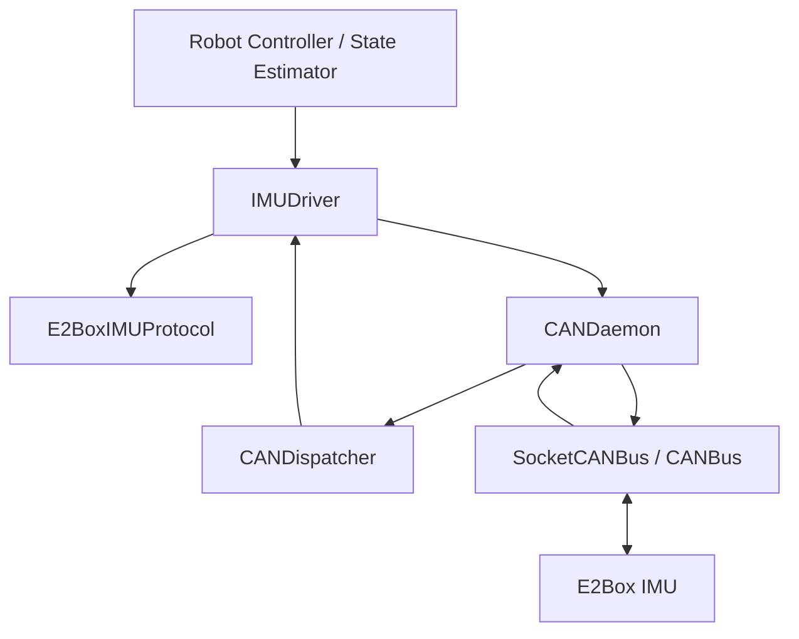
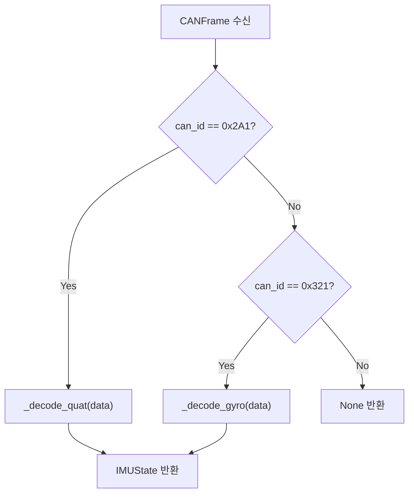

# E2Box IMU CAN Protocol 문서

## 1. 목적

이 문서는 `E2BoxIMUProtocol` 클래스의 역할과 CAN 메시지 구조를 정리한 프로토콜 문서입니다.

해당 클래스는 E2Box IMU와 CAN bus를 통해 통신하기 위한 **프로토콜 계층**입니다.  
즉, 이 클래스는 다음 책임을 가집니다.

- E2Box IMU가 사용하는 CAN ID 정의
- quaternion / gyro 요청 명령 프레임 생성
- 수신 CAN frame의 ID 판별
- quaternion payload 디코딩
- gyro payload 디코딩
- E2Box IMU 좌표계와 로봇 body 좌표계 간의 일부 보정
- projected gravity 계산

반대로, 이 클래스가 직접 담당하지 않아야 하는 책임은 다음과 같습니다.

- SocketCAN socket 생성
- CAN thread 실행
- TX/RX queue 관리
- Dispatcher callback 등록
- IMU 상태 저장 정책
- 장착 위치에 따른 일반화된 좌표계 변환

이러한 기능은 각각 `SocketCANBus`, `CANDaemon`, `CANDispatcher`, `IMUDriver`, `MountingTransform` 계층에서 처리하는 것이 바람직합니다.

---

## 2. 계층 구조에서의 위치



### 역할 분리

| 계층 | 주요 역할 |
|---|---|
| `CANBus` | 실제 CAN frame 송수신 |
| `CANDaemon` | RX/TX thread, TX queue, dispatcher 연결 |
| `CANDispatcher` | CAN ID 기반 callback 라우팅 |
| `E2BoxIMUProtocol` | CAN ID, 명령 opcode, payload encode/decode |
| `IMUDriver` | IMU 상태 저장, request API, callback 처리 |
| `Robot Controller` | IMU state 사용 |

---

## 3. 클래스 개요

```python
class E2BoxIMUProtocol(IMUProtocolBase):
    ...
```

`E2BoxIMUProtocol`은 `IMUProtocolBase`를 상속하는 제조사/기기별 프로토콜 구현체입니다.

### Public API

| 메서드 | 역할 |
|---|---|
| `rx_can_ids()` | 이 프로토콜이 수신할 CAN ID 목록 반환 |
| `encode_request_quat()` | quaternion 요청 frame 생성 |
| `encode_request_gyro()` | gyro 요청 frame 생성 |
| `encode_request_all()` | quaternion + gyro 요청 frame 생성 |
| `decode_frame(frame)` | 수신 CAN frame을 해석하여 `IMUState` 반환 |

### Internal API

| 메서드 | 역할 |
|---|---|
| `_decode_quat(data)` | quaternion payload 해석 |
| `_decode_gyro(data)` | gyro payload 해석 |
| `_normalize_quat(q)` | quaternion 정규화 |
| `_projected_gravity_from_xyzw(q)` | body frame 기준 projected gravity 계산 |

---

## 4. CAN ID 정의

```python
REQ_ID  = 0x221
QUAT_ID = 0x2A1
GYRO_ID = 0x321
```

| 이름 | CAN ID | 방향 | 의미 |
|---|---:|---|---|
| `REQ_ID` | `0x221` | PC → IMU | IMU 데이터 요청 명령 |
| `QUAT_ID` | `0x2A1` | IMU → PC | Quaternion 응답 frame |
| `GYRO_ID` | `0x321` | IMU → PC | Gyro 응답 frame |

### 수신 ID 목록

```python
def rx_can_ids(self) -> list[int]:
    return [self.QUAT_ID, self.GYRO_ID]
```

이 목록은 `CANDispatcher`에 callback을 등록하거나, SocketCAN filter를 설정할 때 사용할 수 있습니다.

---

## 5. Command opcode 정의

```python
CMD_GET_QUAT = 0x01
CMD_GET_GYRO = 0x02
CMD_GET_ALL  = 0x03
```

| 이름 | 값 | 요청 데이터 | 의미 |
|---|---:|---|---|
| `CMD_GET_QUAT` | `0x01` | `01` | Quaternion 요청 |
| `CMD_GET_GYRO` | `0x02` | `02` | Gyro 요청 |
| `CMD_GET_ALL` | `0x03` | `03` | Quaternion + Gyro 요청 |

---

## 6. 송신 frame 생성

### Quaternion 요청

```python
def encode_request_quat(self) -> CANFrame:
    return CANFrame(can_id=self.REQ_ID, data=bytes([self.CMD_GET_QUAT]))
```

| 필드 | 값 |
|---|---|
| CAN ID | `0x221` |
| DLC | `1` |
| Data | `0x01` |

---

### Gyro 요청

```python
def encode_request_gyro(self) -> CANFrame:
    return CANFrame(can_id=self.REQ_ID, data=bytes([self.CMD_GET_GYRO]))
```

| 필드 | 값 |
|---|---|
| CAN ID | `0x221` |
| DLC | `1` |
| Data | `0x02` |

---

### 전체 요청

```python
def encode_request_all(self) -> CANFrame:
    return CANFrame(can_id=self.REQ_ID, data=bytes([self.CMD_GET_ALL]))
```

| 필드 | 값 |
|---|---|
| CAN ID | `0x221` |
| DLC | `1` |
| Data | `0x03` |

---

## 7. 수신 frame 디코딩 흐름

```python
def decode_frame(self, frame: CANFrame) -> IMUState | None:
    if frame.can_id == self.QUAT_ID:
        return self._decode_quat(frame.data)

    if frame.can_id == self.GYRO_ID:
        return self._decode_gyro(frame.data)

    return None
```



---

## 8. Quaternion payload format

Quaternion 응답 frame은 CAN ID `0x2A1`로 수신됩니다.

### Payload 조건

| 항목 | 값 |
|---|---|
| CAN ID | `0x2A1` |
| Payload length | `8 bytes` |
| Endianness | Little-endian |
| Binary format | `<hhhh` |
| Raw type | signed int16 × 4 |
| Scale | `1 / 10000.0` |

### Byte layout

| Byte index | Field | Type | 변환 |
|---:|---|---|---|
| 0-1 | `qz_raw` | int16 little-endian | `qz = qz_raw / 10000.0` |
| 2-3 | `qy_raw` | int16 little-endian | `qy = qy_raw / 10000.0` |
| 4-5 | `qx_raw` | int16 little-endian | `qx = qx_raw / 10000.0` |
| 6-7 | `qw_raw` | int16 little-endian | `qw = qw_raw / 10000.0` |

### 코드

```python
qz_raw, qy_raw, qx_raw, qw_raw = struct.unpack("<hhhh", data)

qz = qz_raw / 10000.0
qy = qy_raw / 10000.0
qx = qx_raw / 10000.0
qw = qw_raw / 10000.0
```

---

## 9. Quaternion convention 보정

현재 구현에서는 E2Box convention 보정을 위해 `qx` 부호를 반전합니다.

```python
# E2Box convention correction.
qx = -qx
```

그 후 내부 표준 순서인 `xyzw`로 정리합니다.

```python
quat_xyzw = self._normalize_quat((qx, qy, qz, qw))
```

### 주의

이 보정은 단순한 payload 디코딩이 아니라 **기기 좌표계 → 로봇 좌표계 변환** 성격을 가집니다.  
따라서 이 변환이 다음 중 무엇에 해당하는지 명확히 구분해야 합니다.

| 가능성 | 위치 |
|---|---|
| E2Box 장치 자체의 고정 convention | `E2BoxIMUProtocol` 내부에 있어도 됨 |
| 로봇에 장착된 방향 때문에 필요한 보정 | `MountingTransform` 또는 `IMUDriver` 쪽이 더 적절 |
| 특정 실험 설정에서만 필요한 임시 보정 | config 기반 option으로 분리 권장 |

---

## 10. Projected gravity 계산

Quaternion을 이용해 world gravity vector를 body frame으로 변환합니다.

### 정의

```text
g_w = [0, 0, -1]
g_b = R(q)^T * g_w
```

코드에서는 inverse quaternion-vector rotation을 직접 계산합니다.

```python
vx, vy, vz = 0.0, 0.0, -1.0
```

계산 후 마지막에 E2Box/robot convention 보정으로 x/y 순서를 바꿉니다.

```python
return vpy, vpx, vpz
```

### 반환값

| 반환 field | 의미 |
|---|---|
| `projected_gravity_b[0]` | 보정 후 body x축 성분 |
| `projected_gravity_b[1]` | 보정 후 body y축 성분 |
| `projected_gravity_b[2]` | 보정 후 body z축 성분 |

### 주의

현재 반환 순서가 일반적인 `(vpx, vpy, vpz)`가 아니라 `(vpy, vpx, vpz)`입니다.

```python
# !!! E2Box/robot convention correction. !!!
return vpy, vpx, vpz
```

이 부분은 매우 중요한 좌표계 의존 코드입니다.  
나중에 IMU 장착 방향이나 body frame convention을 바꾸면 반드시 다시 확인해야 합니다.

---

## 11. Gyro payload format

Gyro 응답 frame은 CAN ID `0x321`로 수신됩니다.

### Payload 조건

| 항목 | 값 |
|---|---|
| CAN ID | `0x321` |
| Payload length | `8 bytes` |
| Endianness | Little-endian |
| Binary format | `<hhhh` |
| Raw type | signed int16 × 4 |
| Scale | `1 / 100.0 deg/s` |
| Final unit | `rad/s` |

### Byte layout

| Byte index | Field | Type | 변환 |
|---:|---|---|---|
| 0-1 | `gx_raw` | int16 little-endian | `(gx_raw / 100.0) * pi / 180.0` |
| 2-3 | `gy_raw` | int16 little-endian | `(gy_raw / 100.0) * pi / 180.0` |
| 4-5 | `gz_raw` | int16 little-endian | `(gz_raw / 100.0) * pi / 180.0` |
| 6-7 | `_reserved` | int16 little-endian | 현재 미사용 |

### 코드

```python
gx_raw, gy_raw, gz_raw, _reserved = struct.unpack("<hhhh", data)

gx = (gx_raw / 100.0) * math.pi / 180.0
gy = (gy_raw / 100.0) * math.pi / 180.0
gz = (gz_raw / 100.0) * math.pi / 180.0
```

---

## 12. Gyro convention 보정

현재 구현에서는 E2Box convention 보정으로 x/y축을 swap합니다.

```python
# E2Box convention correction: swap x/y.
gx, gy = gy, gx
```

그 결과 `IMUState.angular_velocity_rad_s`에는 다음 값이 저장됩니다.

```python
angular_velocity_rad_s=(gx, gy, gz)
```

### 주의

`gx`, `gy`, `gz`는 최종적으로 `rad/s` 단위입니다.  
따라서 변수명이나 state field에 `dps`가 들어가면 안 됩니다.

권장 이름:

```python
angular_velocity_rad_s
```

비권장 이름:

```python
gx_dps
gy_dps
gz_dps
```

---

## 13. 반환되는 IMUState

### Quaternion frame 수신 시

```python
return IMUState(
    quat_xyzw=quat_xyzw,
    projected_gravity_b=projected_gravity_b,
    last_quat_t=time.monotonic(),
)
```

| Field | 값 |
|---|---|
| `quat_xyzw` | 정규화된 quaternion `(qx, qy, qz, qw)` |
| `projected_gravity_b` | body frame 기준 projected gravity |
| `last_quat_t` | `time.monotonic()` 기준 수신 시각 |

---

### Gyro frame 수신 시

```python
return IMUState(
    angular_velocity_rad_s=(gx, gy, gz),
    last_gyro_t=time.monotonic(),
)
```

| Field | 값 |
|---|---|
| `angular_velocity_rad_s` | 보정된 body frame 각속도 `(gx, gy, gz)` |
| `last_gyro_t` | `time.monotonic()` 기준 수신 시각 |

---

## 14. 시간 기준

현재 timestamp는 다음 함수를 사용합니다.

```python
time.monotonic()
```

이는 시스템 clock 변경의 영향을 받지 않는 단조 증가 시간입니다.  
제어/센서 timestamp에는 `time.time()`보다 적합합니다.

단, 여러 프로세스나 외부 로그와 절대 시간을 맞춰야 하면 별도의 wall-clock timestamp도 같이 기록하는 것이 좋습니다.

---

## 15. 예외 처리

### Payload 길이 오류

Quaternion과 gyro 모두 payload 길이가 정확히 8 bytes가 아니면 `ValueError`를 발생시킵니다.

```python
if len(data) != 8:
    raise ValueError(...)
```

### 권장 처리 위치

- `E2BoxIMUProtocol`: 잘못된 payload에 대해 `ValueError` 발생
- `IMUDriver.on_frame()`: protocol decode 예외를 받아 로깅하거나 무시
- `CANDispatcher`: callback 예외가 전체 RX thread를 죽이지 않도록 보호

---

## 16. 사용 예시

```python
from hal.can_bus import CANFrame
from imu.protocols.e2box import E2BoxIMUProtocol

protocol = E2BoxIMUProtocol()

# 요청 frame 생성
request_frame = protocol.encode_request_all()

# 수신 frame 디코딩 예시
rx_frame = CANFrame(
    can_id=0x2A1,
    data=b"\x00\x00\x00\x00\x00\x00\x10\x27",
)

state = protocol.decode_frame(rx_frame)
```

---

## 17. Dispatcher 등록 예시

```python
protocol = E2BoxIMUProtocol()
imu_driver = IMUDriver(name="body_imu", protocol=protocol, daemon=daemon)

for can_id in protocol.rx_can_ids():
    daemon.register_callback(can_id, imu_driver.on_frame)
```

또는 `IMUDriver` 내부에서:

```python
class IMUDriver:
    def register_callbacks(self) -> None:
        for can_id in self.protocol.rx_can_ids():
            self.daemon.register_callback(can_id, self.on_frame)
```

---

## 18. 현재 코드에서 특히 주의할 부분

### 18.1 Protocol과 mounting transform이 섞여 있음

현재 `qx = -qx`, `gx, gy = gy, gx`, `return vpy, vpx, vpz`는 모두 좌표계 보정입니다.

이 보정이 장치 고유 convention인지, 로봇 장착 방향 때문인지 분리해야 합니다.

권장 구조:

```text
E2BoxIMUProtocol
    - raw payload unpack
    - scale 변환

IMUFrameTransformer
    - E2Box frame -> robot body frame 변환

IMUDriver
    - 최종 state 저장
```

---

### 18.2 Quaternion 순서가 raw와 state에서 다름

수신 payload 순서:

```text
qz, qy, qx, qw
```

내부 state 순서:

```text
qx, qy, qz, qw
```

따라서 문서와 코드에서 반드시 `xyzw` 명시가 필요합니다.

---

### 18.3 Gyro 변수명과 단위 불일치 주의

raw 값은 `deg/s * 100` 형태로 보이지만, 최종 state는 `rad/s`입니다.

따라서 최종 state field는 반드시 다음처럼 명명해야 합니다.

```python
angular_velocity_rad_s
```

---

### 18.4 Projected gravity 반환 순서 주의

일반적인 계산 결과는 `(vpx, vpy, vpz)`지만, 현재 구현은 보정 때문에 다음을 반환합니다.

```python
return vpy, vpx, vpz
```

이 부분은 실험 결과와 로봇 body frame 정의에 직접적인 영향을 줍니다.

---

## 19. 권장 TODO

- [ ] `qx = -qx`가 장치 고유 convention인지 장착 방향 보정인지 분리
- [ ] `gx, gy = gy, gx` 보정의 물리적 의미 문서화
- [ ] `return vpy, vpx, vpz` 순서 변경의 근거 문서화
- [ ] raw IMU payload와 robot-frame IMU state를 별도 타입으로 분리
- [ ] `E2BoxIMUProtocol`에는 가능하면 payload decode만 남기고, mounting transform은 별도 클래스로 분리
- [ ] `IMUDriver.on_frame()`에서 `ValueError`를 catch하고 logger로 기록
- [ ] `IMUState` 복사/락 정책 정의
- [ ] CAN logger로 raw frame을 같이 저장하여 좌표계 보정 검증 가능하게 유지

---

## 20. 요약

`E2BoxIMUProtocol`은 E2Box IMU의 CAN 메시지 encode/decode를 담당하는 프로토콜 클래스입니다.

핵심 CAN ID는 다음과 같습니다.

| 항목 | CAN ID |
|---|---:|
| 요청 | `0x221` |
| Quaternion 응답 | `0x2A1` |
| Gyro 응답 | `0x321` |

핵심 payload format은 다음과 같습니다.

| 데이터 | Format | Scale | 최종 단위 |
|---|---|---|---|
| Quaternion | `<hhhh` | `1 / 10000.0` | unit quaternion |
| Gyro | `<hhhh` | `1 / 100.0 deg/s` | `rad/s` |

가장 중요한 주의점은 다음입니다.

```text
현재 코드에는 E2Box convention과 robot body convention 사이의 축 보정이 포함되어 있다.
따라서 이 보정이 기기 고유인지, 로봇 장착 방향 때문인지 명확히 분리해야 한다.
```
