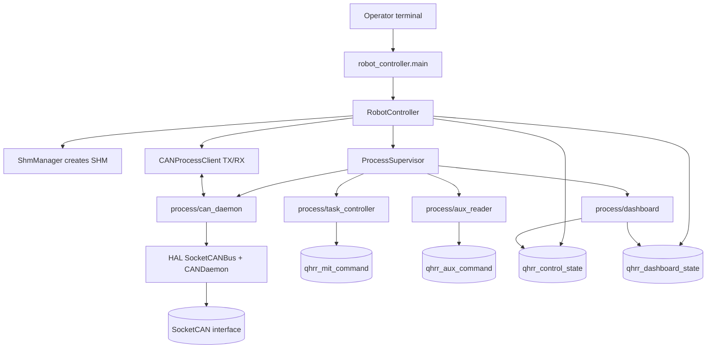

# Architecture

근거 파일: `robot_controller/main.py`, `robot_controller/robot_controller.py`, `robot_controller/runtime_io.py`, `robot_controller/utils/process_supervisor.py`, `robot_controller/process/*`, `app_config/*.yaml`.

## 디렉토리 구조

| 경로 | 역할 |
| --- | --- |
| `app_config/` | project-wide YAML config. `platform.yaml`, `robot_controller.yaml`, `processes.yaml`, `dashboard.yaml`, `mujoco.yaml` |
| `robot_controller/core/` | config loader, state enum/dataclass, Robot State SHM JSON reader/writer |
| `robot_controller/utils/` | process supervisor, CAN daemon client, SHM manager, MIT command SHM router |
| `robot_controller/process/can_daemon/` | SocketCAN을 소유하는 CAN subprocess |
| `robot_controller/process/task_controller/` | ONNX policy inference와 MIT command SHM writer |
| `robot_controller/process/aux_reader/` | joystick input을 `aux_command` SHM에 publish |
| `robot_controller/process/dashboard/` | FastAPI dashboard backend/frontend |
| `robot_controller/QHRR0_HW/` | E2Box IMU, SPG actuator protocol 구현 |
| `run_mujoco_simulation.py` | repository root에서 MuJoCo simulate build/launch |
| `third_party/` | handoff 분석 대상 제외 |

## 주요 모듈과 클래스

| 파일 | 주요 식별자 | 책임 |
| --- | --- | --- |
| `robot_controller/main.py` | `main()` | config load, signal handler, `RobotController.start/run/shutdown` |
| `robot_controller/robot_controller.py` | `RobotController` | SHM lifecycle, process lifecycle, 500 Hz tick workflow |
| `robot_controller/runtime_io.py` | `RobotControllerRuntimeIO` | CAN daemon 연결, driver callback, IMU request, actuator command, state publish |
| `robot_controller/utils/process_supervisor.py` | `ProcessSupervisor` | subprocess start/stop/status/log/pidfile |
| `robot_controller/process/can_daemon/main.py` | `CANSubprocessDaemon` | HAL `SocketCANBus`/`CANDaemon` 소유, Unix socket IPC |
| `robot_controller/process/task_controller/main.py` | `main()` | SHM read, policy inference, MIT target batch publish |
| `robot_controller/core/robot_state_shm.py` | `RobotStateShmWriter`, `RobotStateShmReader` | JSON payload SHM seqlock-style publish/read |
| `robot_controller/utils/shm_command_router.py` | `ShmMitCommandWriter`, `ShmMitCommandRouter` | binary MIT command SHM write/read |

## 전체 프로세스 구조



## 데이터 흐름

```mermaid
flowchart LR
    canbus[(CAN bus)] --> candaemon[CAN daemon]
    candaemon --> runtime[RobotControllerRuntimeIO callbacks]
    runtime --> drivers[IMUDriver / ActuatorDriver]
    drivers --> control[(qhrr_control_state 500 Hz)]
    drivers --> dashstate[(qhrr_dashboard_state 10 Hz)]

    joystick[/dev/input/js0] --> aux[aux_reader]
    aux --> auxshm[(qhrr_aux_command)]

    control --> task[task_controller]
    auxshm --> task
    task --> policy[ONNX policy]
    policy --> mit[(qhrr_mit_command)]
    mit --> controller[RobotController tick]
    controller --> runtime
    runtime --> candaemon
    candaemon --> canbus

    dash[dashboard] --> control
    dash --> dashstate
    dash --> candaemon
```

## 프로세스/스레드 구조

| Runtime | 코드상 구조 |
| --- | --- |
| `robot_controller.main` | foreground process. signal handler가 `controller.request_stop()` 호출 |
| `can_daemon` | `ProcessSupervisor`가 별도 터미널로 실행. CAN server accept loop + client handler threads + HAL daemon internal threads |
| `task_controller` | 별도 프로세스. 50 Hz 기본 loop에서 policy inference |
| `aux_reader` | 별도 프로세스. joystick device nonblocking read |
| `dashboard` | 별도 프로세스. FastAPI/Uvicorn + asyncio loops: SocketCAN monitor, IMU poll, MIT poll |
| `CANProcessClient` | RX enabled이면 `CAN_DAEMON_CLIENT_RX` daemon thread 생성 |

## `ProcessSupervisor` 책임

| 책임 | 확인된 동작 |
| --- | --- |
| 시작 순서 | `processes.yaml start_order` 오름차순 |
| 종료 순서 | `processes.yaml stop_order` 오름차순 |
| terminal launch | `new_terminal: true`이면 `gnome-terminal --wait -- bash -lc ...` |
| log | `log/YYYYMMDD_HHMMSS/<process>.log`에 stdout/stderr tee |
| pidfile | `/tmp/qhrr_robot_controller_processes/<name>.pid` |
| timeout | stop timeout 이후 SIGKILL, warning log |

## CAN daemon 책임

| 책임 | 확인된 동작 |
| --- | --- |
| SocketCAN 소유 | `SocketCANBus(config.can.interface)` |
| HAL daemon 소유 | `CANDaemon(rx_timeout, tx_timeout, join_timeout, max_tx_queue_size)` |
| TX IPC | Unix socket JSON line `{"type":"tx","can_id":...,"data":"..."}` |
| RX broadcast | wildcard callback으로 RX subscribers에 JSON line publish |
| own TX echo | raw socket `CAN_RAW_RECV_OWN_MSGS`를 0으로 설정 |
| socket cleanup | shutdown 시 Unix socket unlink |

## SafetyManager

`SafetyManager` 클래스 또는 명시적 safety manager process는 코드에서 확인되지 않았다. 안전 관련 처리는 `RobotControllerRuntimeIO.validate_mit_batch()`, `send_damping_once()`, process shutdown path, config validation에 흩어져 있다.

## Simulation Mode와 Hardware Mode

| 항목 | Simulation | Hardware |
| --- | --- | --- |
| mode flag | `app_config/mujoco.yaml mujoco_can.enabled`는 MuJoCo 쪽 config | UNKNOWN: `robot_controller`에 별도 hardware/simulation flag 없음 |
| CAN interface | `app_config/platform.yaml can.interface: vcan0` | 같은 key를 실제 interface로 바꾸는 구조로 보임 |
| simulator 실행 | `python3 run_mujoco_simulation.py` | 해당 없음 |
| controller 실행 | 동일하게 `python3 -m robot_controller.main --config app_config/robot_controller.yaml` | 동일 entrypoint |
| 위험 | simulator가 없으면 feedback이 없고 timeout/stale 상태가 발생 | 실제 actuator에 `enter_on_start` frame이 나갈 수 있음 |

## 검증 필요 항목

| 항목 | 질문 |
| --- | --- |
| Process death reaction | TODO(owner): `task_controller` 등 child process 사망 시 supervisor가 재시작하지 않는 것이 의도인지 확인 |
| terminal dependency | TODO(owner): `gnome-terminal`이 없는 환경에서 process manager 운용 방법 |
| hardware mode | TODO(owner): 실제 CAN interface 전환 절차와 별도 safety gate 필요 여부 |
| SafetyManager | TODO(owner): 별도 `SafetyManager`를 도입할지, 현재 분산 검증을 유지할지 결정 |
