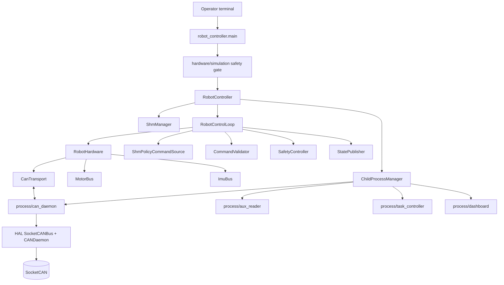
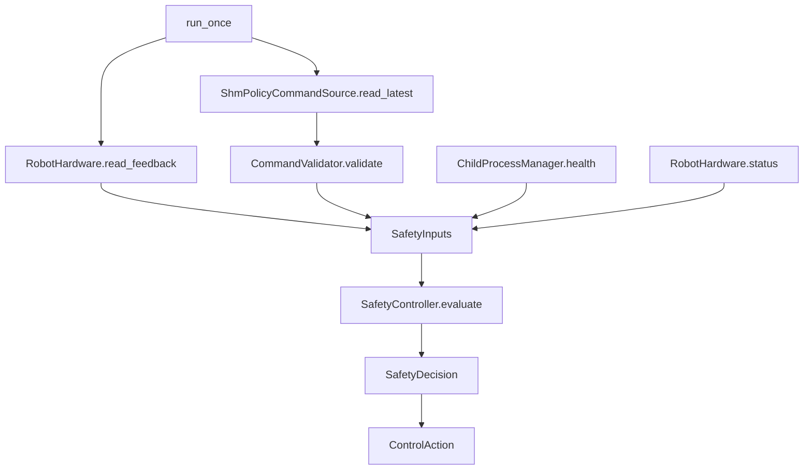

# Architecture

근거 파일: `robot_controller/main.py`, `robot_controller/robot_controller.py`, `robot_controller/control_loop.py`, `robot_controller/hardware/*`, `robot_controller/command/*`, `robot_controller/safety/*`, `robot_controller/state/*`, `robot_controller/processes/*`, `config/app_config/*.yaml`.

## 핵심 구조

이번 구조의 기준은 소프트웨어 인프라 이름이 아니라 실제 로봇 제어 흐름이다.

```text
read feedback
-> read policy command
-> validate command shape/range
-> evaluate safety
-> send policy / send damping-like MIT command / disable / no output
-> publish state
```

이 흐름은 `RobotController.run_once()`와 `RobotControlLoop.run_once()`에서 바로 보인다.

## 디렉토리 구조

| Path | Role |
| --- | --- |
| `robot_controller/main.py` | CLI, config load, hardware/simulation safety gate |
| `robot_controller/robot_controller.py` | startup/shutdown lifecycle, `run_once()` delegation |
| `robot_controller/control_loop.py` | one tick의 `read -> decide -> act -> publish` workflow |
| `robot_controller/hardware/` | `MotorBus`, `ImuBus`, `RobotHardware`, CAN transport |
| `robot_controller/command/` | `ShmPolicyCommandSource`, `CommandValidator`, policy command dataclasses |
| `robot_controller/safety/` | `SafetyController`, `SafetyState`, `ControlAction`, `SafetyDecision` |
| `robot_controller/state/` | `StatePublisher`: control/dashboard SHM publish |
| `robot_controller/processes/` | `ChildProcessManager`, `ProcessHealth` |
| `robot_controller/process/` | child process entrypoints: CAN daemon, task controller, aux reader, dashboard |
| `robot_controller/utils/` | low-level compatibility utilities: SHM manager/writer, CAN daemon client |
| `config/app_config/` | shared YAML config |

## 주요 클래스

| Class | File | Responsibility |
| --- | --- | --- |
| `RobotController` | `robot_controller/robot_controller.py` | SHM/process/hardware lifecycle, top-level loop |
| `RobotControlLoop` | `robot_controller/control_loop.py` | one control tick workflow |
| `RobotHardware` | `robot_controller/hardware/robot_hardware.py` | `MotorBus` + `ImuBus` facade |
| `MotorBus` | `robot_controller/hardware/motor_bus.py` | actuator driver callbacks, enable/disable, policy MIT batch, damping-like MIT command |
| `ImuBus` | `robot_controller/hardware/imu_bus.py` | IMU request/feedback cache |
| `CanTransport` | `robot_controller/hardware/can_transport.py` | CAN daemon client, TX, callback registration, TX echo rejection |
| `ShmPolicyCommandSource` | `robot_controller/command/shm_policy_command_source.py` | MIT command SHM read, layout/sequence/status reporting |
| `CommandValidator` | `robot_controller/command/command_validator.py` | NaN/Inf, limit, duplicate/missing/unknown CAN ID, actuator order validation |
| `SafetyController` | `robot_controller/safety/safety_controller.py` | command/process/feedback/hardware safety decision |
| `StatePublisher` | `robot_controller/state/state_publisher.py` | control/dashboard Robot State SHM publish |
| `ChildProcessManager` | `robot_controller/processes/child_process_manager.py` | process start/stop/status and `ProcessHealth` |

## 전체 프로세스 구조



## 데이터 흐름

```mermaid
flowchart LR
    can[(CAN bus)] --> daemon[CAN daemon]
    daemon --> transport[CanTransport RX callbacks]
    transport --> motorbus[MotorBus feedback cache]
    transport --> imubus[ImuBus feedback cache]
    motorbus --> feedback[RobotFeedback]
    imubus --> feedback

    auxdev[/dev/input/js0] --> aux[aux_reader]
    aux --> auxshm[(qhrr_aux_command)]
    feedback --> controlshm[(qhrr_control_state)]
    feedback --> dashshm[(qhrr_dashboard_state)]
    controlshm --> task[task_controller]
    auxshm --> task
    task --> mitshm[(qhrr_mit_command)]
    mitshm --> source[ShmPolicyCommandSource]
    source --> validator[CommandValidator]
    validator --> safety[SafetyController]
    feedback --> safety
    proc[ProcessHealth] --> safety
    safety --> action{ControlAction}
    action -->|SEND_POLICY_COMMAND| motorbus
    action -->|SEND_DAMPING| motorbus
    action -->|DISABLE_MOTORS| motorbus
    motorbus --> daemon
```

## Safety Decision Flow



## Process Health Flow

`ChildProcessManager.health()`는 제어 루프에 다음 정보를 제공한다.

| Field | Safety behavior |
| --- | --- |
| `can_daemon_alive` | false이면 `FAULT_LATCHED` + `DISABLE_MOTORS` |
| `task_controller_alive` | false이면 command loss path: `DAMPING` |
| `aux_reader_alive` | hardware mode에서는 false이면 `FAULT_LATCHED` |
| `dashboard_alive` | control에는 영향 없음. dashboard death는 warning/observability 대상 |

## Simulation Mode vs Hardware Mode

| Mode | Gate |
| --- | --- |
| `simulation` | real CAN interface `can0`, `can1` reject. `can.motors.enter_on_start` reject. |
| `hardware` | `--hardware`, `--i-understand-this-can-enable-motors`, `--estop-ok`, `hardware.allow_real_can: true`, non-vcan interface, allowed interface list, manual arm required, enable-on-start forbidden. |

Hardware mode는 `SafetyState.DISARMED`에서 시작한다. Dashboard `Arm`, `Fault Clear`, `E-STOP`은 `qhrr_operator_command` SHM을 통해 controller main loop로 전달된다. Startup 중 motor enable command는 보내지 않는다.

## 검증 필요 항목

| 항목 | 질문 |
| --- | --- |
| Operator arming | TODO(owner): dashboard operator command path를 실제 hardware arming 절차와 함께 검증 |
| Process restart | TODO(owner): child process 사망 시 재시작할지 fault latch만 할지 운영 정책 |
| E-stop source | TODO(owner): `--estop-ok`를 실제 E-stop monitor로 대체 |
