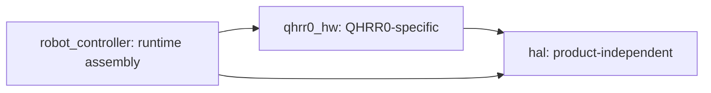
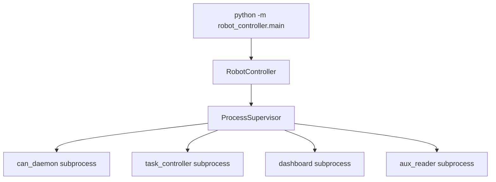

# Architecture

이 문서는 현재 Python runtime 구조 기준이다. `RobotController`가 상태 머신과 HAL 호출 순서를 직접 소유한다.

## Directory Layout

| Path | Responsibility |
| --- | --- |
| `hal/` | 제품 독립 CAN frame, CAN daemon, dispatcher, bus/process transport, base device driver/protocol |
| `qhrr0_hw/` | QHRR0-specific actuator/IMU protocol, CAN ID map, joint map, calibration, robot spec |
| `robot_controller/controller.py` | `RobotController` runtime, 상태 머신 update, 최종 actuator output dispatch |
| `robot_controller/state_machine.py` | `ControllerMode`, `OperatorCommandCode`, transition policy |
| `robot_controller/shm/` | SHM base/manager modules and ctypes command/state types |
| `robot_controller/supervisor/` | child process lifecycle |
| `robot_controller/subprocesses/` | `can_daemon`, `task_controller`, `dashboard`, `aux_reader` entrypoints |

## Dependency Rule


```mermaid
flowchart LR
    hal[hal: product-independent]
    hw[qhrr0_hw: QHRR0-specific]
    rc[robot_controller: runtime assembly]

    hw --> hal
    rc --> hal
    rc --> hw
```

`hal` must not import `qhrr0_hw`.

## Runtime Processes


```mermaid
flowchart TB
    main[python -m robot_controller.main]
    rc[RobotController]
    sup[ProcessSupervisor]
    can[can_daemon subprocess]
    task[task_controller subprocess]
    dash[dashboard subprocess]
    aux[aux_reader subprocess]

    main --> rc
    rc --> sup
    sup --> can
    sup --> task
    sup --> dash
    sup --> aux
```

`ProcessSupervisor` starts child processes using `config/app_config/processes.yaml`, creates `log/<YYYYMMDD_HHMMSS>/`, and stops managed subprocesses during controller shutdown.

## RobotController Ownership

`RobotController` directly owns:

| Field | Meaning |
| --- | --- |
| `self.can` | HAL `CANProcessTransport` |
| `self.actuators` | `dict[int, ActuatorDriver]` built from `qhrr0_hw.robot_spec` |
| `self.imu` | HAL `IMUDriver` using QHRR0 E2BOX protocol |
| `self.control_cmd_shm` | `ControlCommandShm` reader |
| `self.operator_cmd_shm` | `OperatorCommandShm` reader |
| `self.control_state_shm` | high-rate `RobotStateShm` writer |
| `self.dashboard_state_shm` | low-rate dashboard `RobotStateShm` writer |
| `self.state_machine` | `ControlModeFsm` |

Actuator callbacks are registered in `RobotController._register_callbacks()`. Multiple actuator commands are simple for-loops inside `RobotController` private methods. `RobotController` builds `RobotStateC` directly; there is no intermediate `RobotSnapshot` telemetry layer.

## CAN Daemon Responsibility

`robot_controller.subprocesses.can_daemon.main` creates a HAL `CANDaemon` over `SocketCANBus`. It owns raw SocketCAN I/O and IPC socket serving. It does not know QHRR0 actuator names, joint order, calibration, or product protocol policy.

## Simulation vs Hardware

Startup safety validation is in `robot_controller/config/validation.py`.

| Mode | Current behavior |
| --- | --- |
| `simulation` | rejects real `canN` interface |
| `hardware` | requires `--hardware`, `--i-understand-this-can-enable-motors`, `--estop-ok`, allowed real CAN interface, and `hardware.allow_real_can: true` |

## Verification

```bash
rg -n "qhrr0_hw|QHRR0|SPG|DongilC|E2BOX|joint|calibration" hal -g '*.py'
find robot_controller -maxdepth 2 -type d | sort
```
