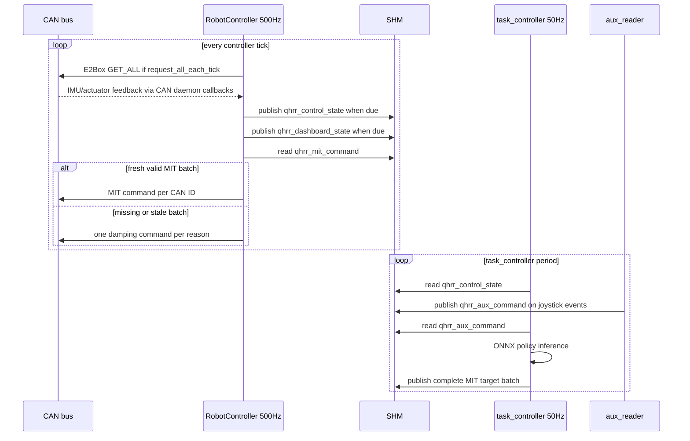
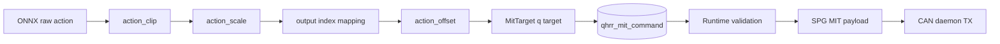

# Control Loop

근거 파일: `robot_controller/robot_controller.py`, `robot_controller/runtime_io.py`, `robot_controller/process/task_controller/main.py`, `robot_controller/process/task_controller/policy.py`, `robot_controller/process/task_controller/shm_io.py`, `app_config/robot_controller.yaml`, `app_config/platform.yaml`.

## 주기

| Loop | 위치 | 기본 값 | Config/source |
| --- | --- | --- | --- |
| Main controller tick | `RobotController.run()` | 500 Hz | `robot_controller.control_hz` |
| Control state publish | `RuntimeIO.publish_due_states()` | 500 Hz | `shm.control_state.publish_hz` |
| Dashboard state publish | `RuntimeIO.publish_due_states()` | 10 Hz | `shm.dashboard_state.publish_hz` |
| Task policy inference | `task_controller.main` | 50 Hz | `--control-hz`, env `TASK_CONTROL_HZ`, code default `50.0` |
| Dashboard websocket | dashboard backend | 24 Hz | `dashboard.state_hz` |
| Dashboard IMU poll UI loop | dashboard backend | 400 Hz | `imu.default_poll_hz`; robot controller도 tick마다 IMU request |

## Timing Diagram

## Main Loop Workflow

`RobotController.run()`의 tick 순서:

1. `request_imu_on_tick()`
2. `command_router.read_latest_batch()`
3. batch 없음: `send_damping_once("no MIT command batch available")`
4. batch stale: `send_damping_once("MIT command batch is stale: source=...")`
5. batch fresh: `validate_mit_batch()`, `mark_mit_command_active()`, `send_mit_batch()`
6. `publish_due_states()`
7. tick timing update

## Policy Observation 생성 순서

`task_controller`의 순서:

1. `ControlStateReader.latest()`로 `qhrr_control_state` JSON payload read
2. `AuxCommandReader.latest()`로 `qhrr_aux_command` JSON payload read
3. `state_vectors(control_state, can_ids)`:
   - actuator position/velocity는 `can_ids` 순서대로 추출
   - IMU `quat_xyzw`를 policy용 `quat_wxyz`로 변환
   - IMU `angular_velocity_rad_s`를 `gyro`로 사용
4. `OnnxPolicy.set_state(dof_pos, dof_vel, quat_wxyz, gyro)`
5. joystick command:
   - `lin_vel_target[0]`
   - `lin_vel_target[1]`
   - `ang_vel_target[2]`
   - `buttons["a_button"]`가 `mode`
6. `OnnxPolicy.compute_action()`
7. `q_target = scaled_action + action_offset(...)`
8. `MitTarget` batch publish

`OnnxPolicy._observation()`의 component 순서는 `obs_config.yaml observations.components`가 있으면 그것을 따른다. 없으면 code default:

| 순서 | component |
| --- | --- |
| 1 | `base_ang_vel_` |
| 2 | `projected_gravity` |
| 3 | `lin_vel_x_commands_` |
| 4 | `lin_vel_y_commands_` |
| 5 | `ang_vel_z_commands_` |
| 6 | `delta_dof_pos` |
| 7 | `dof_vel` |
| 8 | `actions` |

## Action 해석 방식

| 단계 | 내용 |
| --- | --- |
| ONNX output | `session.run()` output을 1D로 펼치고 `num_joint`까지만 사용 |
| clipping | `np.clip(raw, -action_clip, action_clip)` |
| scaling | `actions * action_scale` |
| output index mapping | `joint_idx_conversion_<style>.output` |
| offset | `qhrr`, `qhrr1`은 `default_joint_angle` |
| target | `position_rad=q_target[index]`, `velocity_rad_s=0`, `kp=pd_config["kp"]`, `kd=pd_config["kd"]`, `torque_ff_nm=0` |

## PD 제어식

Python controller는 PD torque를 직접 계산하지 않는다. `task_controller`는 MIT impedance command field인 `q`, `qd`, `kp`, `kd`, `tau_ff`를 생성하고, `SPGActuatorProtocol`이 payload packing을 수행한다.

UNKNOWN: actuator firmware 내부에서 사용하는 정확한 torque equation.

## Joint Order

현재 `app_config/platform.yaml` enabled actuator 순서:

| index | name | CAN ID |
| --- | --- | --- |
| 0 | `RL_hip_roll` | `0x141` |
| 1 | `RL_hip_pitch` | `0x142` |
| 2 | `RL_knee_pitch` | `0x143` |

`task_controller`는 `controller_config.can.motors.can_ids` 순서대로 `dof_pos`, `dof_vel`, `MitTarget`을 구성한다. ONNX policy 내부 input/output remapping은 `runner_config.yaml joint_idx_style`과 `joint_idx_conversion_<style>`를 따른다.

## 단위와 좌표계

| 값 | 단위/형식 | 근거 |
| --- | --- | --- |
| actuator position | rad | `position_rad` |
| actuator velocity | rad/s | `velocity_rad_s` |
| torque feed-forward | Nm | `torque_ff_nm` |
| IMU quaternion in Robot State | `xyzw` | `quat_xyzw` |
| policy quaternion | `wxyz` | `state_vectors()` 변환 |
| E2Box CAN quaternion payload | raw order `qz_raw, qy_raw, qx_raw, qw_raw` | `E2BoxIMUProtocol._decode_quat()` |
| gyro | rad/s | raw deg/s scale 후 rad 변환 |
| projected gravity | body frame tuple | `projected_gravity_b` |

## Saturation / Limit

| 경계 | 제한 |
| --- | --- |
| Policy action | `action_clip`, `action_scale` from `runner_config.yaml` |
| Runtime MIT validation | `can.mit_limits.position_rad`, `velocity_rad_s`, `kp`, `kd`, `torque_ff_nm` |
| SPG packing | `SPGMITConfig` p/v/kp/kd/tau max |
| Config validation | `kd >= 0.5` because shutdown damping uses kd=0.5 |

## Torque/Position/Velocity Command 흐름

## 검증 필요 항목

| 항목 | 질문 |
| --- | --- |
| policy frequency | TODO(owner): 50 Hz task policy와 500 Hz controller tick의 의도된 decimation 비율 |
| PD equation | TODO(owner): firmware MIT equation과 sign convention 확인 |
| joint mapping | TODO(owner): policy runner config의 input/output index와 platform actuator 순서 검증 |
| IMU frame | TODO(owner): E2Box convention correction이 실제 robot body frame과 일치하는지 검증 |
