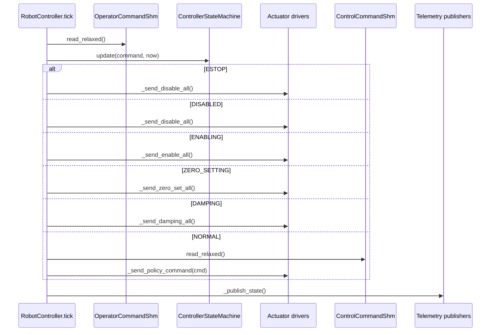

# Control Loop

현재 제어 루프는 `robot_controller/controller.py`의 `RobotController.tick()`에서 직접 보인다.

## Frequency

| Loop | Config/source | Current value |
| --- | --- | --- |
| RobotController tick | `robot_controller.control_hz` | `500` Hz in `config/app_config/robot_controller.yaml` |
| Task controller policy output | `TASK_CONTROL_HZ` env | `50.0` Hz in `config/app_config/processes.yaml` |
| Dashboard state publish | `shm.dashboard_state.publish_hz` | `10` Hz |
| Control state SHM publish | `shm.control_state.publish_hz` | `500` Hz |

## Tick Workflow

## State Output Rule

| `ControllerMode` | Actuator output |
| --- | --- |
| `ESTOP` | disable all only |
| `DISABLED` | disable all only |
| `ENABLING` | enable all only |
| `ZERO_SETTING` | zero set all only |
| `DAMPING` | MIT velocity damping-like command all only |
| `NORMAL` | policy command from `ControlCommandShm` only |

`NORMAL` is the only mode that calls `ControlCommandShm.read_relaxed()`.
Arm does not enter `NORMAL` directly. After `enable_duration_s`, `ENABLING` transitions to `DAMPING`; a separate `RUN` operator command transitions `DAMPING` to `NORMAL`.

## MIT Damping-Like Command

`RobotController._send_damping_all()` sends:

| Field | Value |
| --- | --- |
| `position_rad` | `0.0` |
| `velocity_rad_s` | `0.0` |
| `kp` | `0.0` |
| `kd` | `config.safety.velocity_damping_kd` |
| `torque_ff_nm` | `0.0` |

This is named damping-like because hardware safety semantics depend on actuator firmware behavior.

## Policy Command Handling

`ControlCommandShm` is a relaxed ctypes SHM view. Motor command tearing is intentionally allowed. It does not use consistency counters or double buffering.

`RobotController._send_policy_command()` iterates up to `min(cmd.num_targets, len(cmd.targets))`, looks up the actuator by `target.can_id`, and sends an impedance command frame for known CAN IDs.
