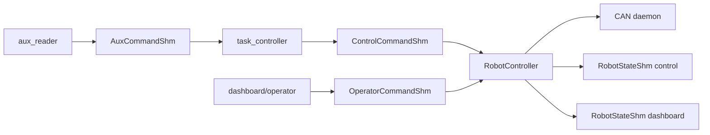

# QHRR0-control Handoff

## One-Page Summary

QHRR0-control은 Python `RobotController`가 HAL CAN process transport와 QHRR0-specific hardware spec을 조립해 actuator/IMU를 제어하는 runtime이다. 현재 구조의 핵심은 `robot_controller/controller.py`에 상태별 actuator output path가 직접 보이는 것이다.

제품 독립 계층은 `hal/`, QHRR0 제품 종속 계층은 최상단 `qhrr0_hw/`, runtime 조립과 process 관리는 `robot_controller/`가 담당한다.

## Quick Start

```bash
sudo modprobe vcan
sudo ip link add dev vcan0 type vcan
sudo ip link set up vcan0
python3 -m robot_controller.main --config config/app_config/robot_controller.yaml
```

Dashboard default URL:

```text
http://127.0.0.1:8000
```

## Runtime Map



## Must-Know Rules

| Rule | Current implementation |
| --- | --- |
| HAL purity | `hal` must not import `qhrr0_hw` |
| Product-specific code | actuator/IMU protocol, CAN ID map, joint map, calibration live in `qhrr0_hw/` |
| Final actuator output | selected only by `RobotController.tick()` |
| Policy command read | only in `ControllerMode.NORMAL` |
| SHM consistency | motor command tearing is allowed |
| Operator control | operator writes `OperatorCommandShm`; controller transitions state |
| Telemetry | `ShmStatePublisher` and `DashboardPublisher` are separate |

Arm and run are intentionally split: `ENABLE` moves through `ENABLING` into `DAMPING`, and only `RUN` moves `DAMPING` into `NORMAL` policy output.

## Real Robot Checklist

- Confirm `runtime.mode: hardware`.
- Confirm real CAN interface is intended and listed in `hardware.allowed_can_interfaces`.
- Confirm `hardware.allow_real_can: true`.
- Confirm `can.motors.enter_on_start: false`.
- Start only with explicit flags:

```bash
python3 -m robot_controller.main \
  --config config/app_config/robot_controller.yaml \
  --hardware \
  --i-understand-this-can-enable-motors \
  --estop-ok
```

## Important Warnings

1. `ControllerMode.NORMAL` sends whatever relaxed policy command is currently in `ControlCommandShm`; do not enter `NORMAL` unless policy output is intended.
2. Unknown CAN IDs in policy command are skipped by current code; review before real hardware deployment.
3. `safety.command_loss_action`, `safety.feedback_stale_action`, and `safety.damping_timeout_s` are parsed but not enforced by current `tick()`.
4. The damping output is MIT damping-like command, not independently proven hardware-safe behavior.
5. Dashboard direct actuator commands must not be treated as a safety authority; controller state is the authority.
