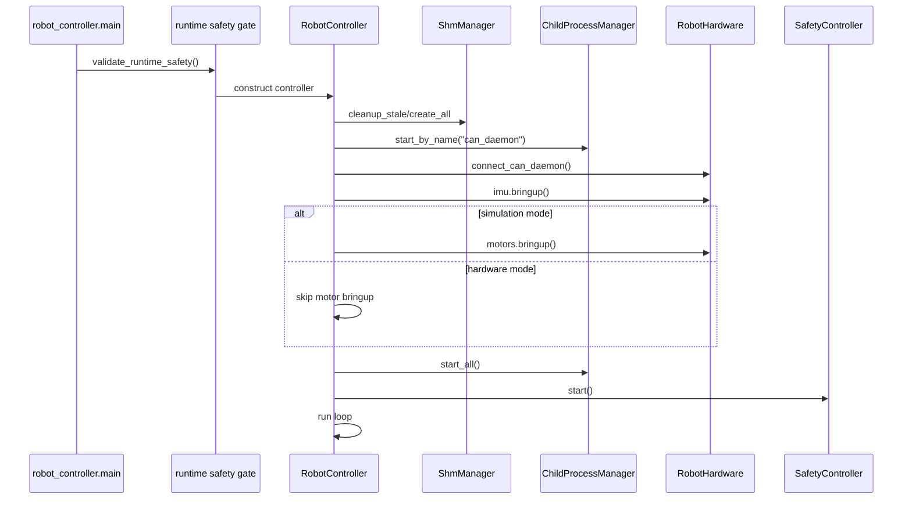
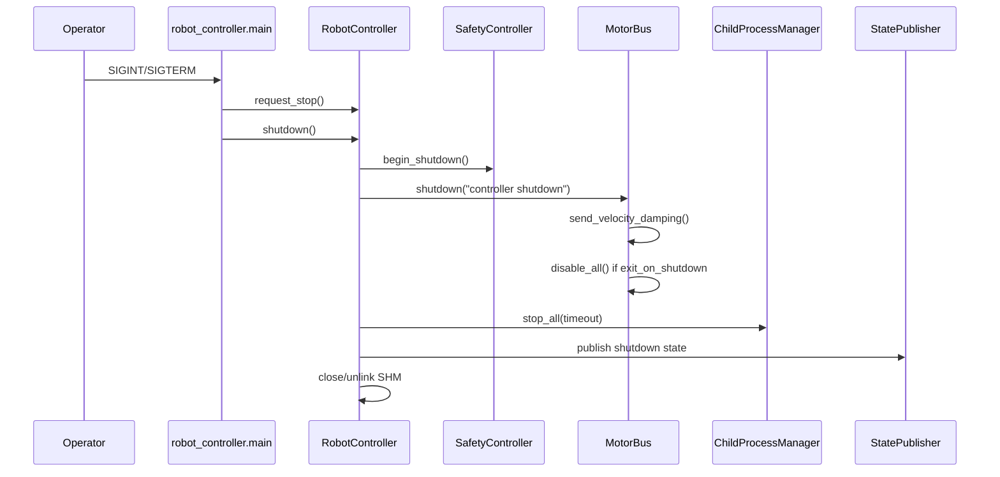

# Runbook

이 문서는 현재 코드 entrypoint와 config를 기준으로 한다.

## Simulation 실행

현재 기본 config는 `runtime.mode: simulation`, `can.interface: vcan0`이다.

```bash
sudo modprobe vcan
sudo ip link add dev vcan0 type vcan
sudo ip link set up vcan0
python3 -m robot_controller.main --config config/app_config/robot_controller.yaml
```

Dashboard:

```text
http://127.0.0.1:8000
```

MuJoCo simulation:

```bash
python3 run_mujoco_simulation.py
```

## Hardware 실행

Hardware mode는 YAML만 바꿔서는 실행되지 않는다. `runtime.mode: hardware`와 CLI flags가 모두 필요하다.

```bash
python3 -m robot_controller.main \
  --config config/app_config/robot_controller.yaml \
  --hardware \
  --i-understand-this-can-enable-motors \
  --estop-ok
```

필수 확인:

| Config/Flag | 의미 |
| --- | --- |
| `runtime.mode: hardware` | hardware safety gate 활성화 |
| `--hardware` | hardware 실행 의도 확인 |
| `--i-understand-this-can-enable-motors` | 실제 motor enable 가능성 확인 |
| `--estop-ok` | E-stop 확인 |
| `hardware.allow_real_can: true` | real CAN 사용 허용 |
| `hardware.allowed_can_interfaces` | 허용 interface 목록 |
| `can.motors.enter_on_start: false` | startup enable 금지 |

Dashboard `Arm`, `Fault Clear`, `E-STOP`은 `qhrr_operator_command` SHM을 통해 controller main loop로 전달된다. Hardware mode는 `DISARMED`에서 시작하며 startup 중 motor enable command를 보내지 않는다.

## Startup Sequence



## Normal Shutdown

`Ctrl+C` 또는 SIGTERM을 `robot_controller.main`에 보낸다.



## Log 확인

`ChildProcessManager`는 실행마다 아래 폴더를 만든다.

```bash
ls -td log/* | head
tail -f log/<YYYYMMDD_HHMMSS>/can_daemon.log
tail -f log/<YYYYMMDD_HHMMSS>/task_controller.log
tail -f log/<YYYYMMDD_HHMMSS>/dashboard.log
```

pidfile:

```bash
ls /tmp/qhrr_robot_controller_processes
cat /tmp/qhrr_robot_controller_processes/task_controller.pid
```

## 비정상 종료 후 복구

| Symptom | Check | Recovery |
| --- | --- | --- |
| child process 남음 | pidfile, `ps -p <pid>` | SIGTERM 후 필요 시 SIGKILL |
| CAN daemon socket 남음 | `ls -l /tmp/qhrr_can_daemon.sock` | 다음 can_daemon은 `--replace-existing-socket` 사용 |
| SHM stale | startup failure log | `cleanup_stale_on_start: true`로 controller startup 시 cleanup |
| `FAULT_LATCHED` | dashboard/control_state `safety_state` | 현재 operator clear path 필요 |
| `task_controller`가 `waiting for numeric control_state`를 계속 출력 | actuator가 MIT enter 전이거나 status-producing MIT response가 아직 없음 | Dashboard/command path에서 MIT enter 및 MIT poll 수행 여부, CAN traffic, simulator/firmware feedback 확인 |

## 자주 쓰는 Command

```bash
PYTHONDONTWRITEBYTECODE=1 python3 -m unittest discover -s tests
python3 -m robot_controller.main --help
python3 -m robot_controller.main --config config/app_config/robot_controller.yaml
python3 -m robot_controller.process.can_daemon.main --config config/app_config/robot_controller.yaml --replace-existing-socket
python3 run_mujoco_simulation.py --help
candump -td vcan0
cansend vcan0 221#03
```

## 검증 필요 항목

| 항목 | 질문 |
| --- | --- |
| Hardware arm | TODO(owner): dashboard `Arm` command를 실제 robot arming 절차와 함께 검증 |
| Dependency install | TODO(owner): Python/system package 설치 절차 |
| Real CAN bringup | TODO(owner): actual interface bitrate setup |
