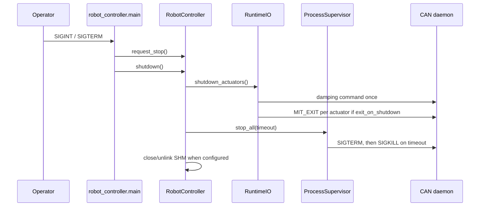
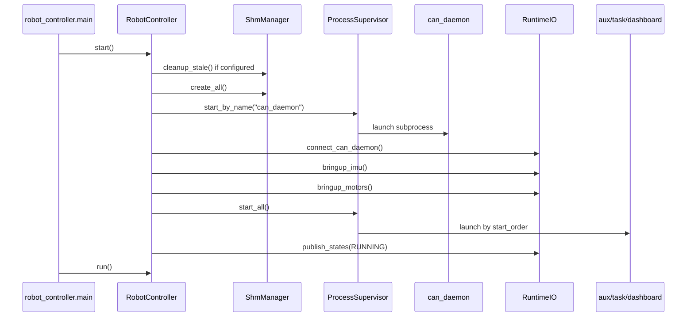

# Runbook

이 문서는 코드에서 확인된 entrypoint와 config만 사용한다. dependency 설치 명령은 repository에서 확정된 lockfile/installer를 확인하지 못했으므로 `UNKNOWN`으로 표시한다.

## 개발 환경 설치

| 항목 | 코드상 필요 |
| --- | --- |
| Python | `python3` 실행 전제 |
| Python packages | `yaml`, `numpy`, `onnxruntime`, `fastapi`, `uvicorn`, `pydantic` import 확인 |
| System tools | `cmake`, `gnome-terminal`, SocketCAN, optional `candump/cansend` |
| Hardware/device | 기본 config는 `vcan0`, aux는 `/dev/input/js0` |

UNKNOWN: 공식 dependency 설치 command는 코드에서 확인되지 않았다.

## vcan 준비

```bash
sudo modprobe vcan
sudo ip link add dev vcan0 type vcan
sudo ip link set up vcan0
ip link show vcan0
```

이미 존재하면 `ip link add`는 실패한다. 이 경우 `ip link show vcan0`로 상태를 확인한다.

## Build 절차

MuJoCo simulate binary는 `run_mujoco_simulation.py`가 필요 시 build한다.

```bash
python3 run_mujoco_simulation.py --help
python3 run_mujoco_simulation.py
```

수동 build command는 script에서 다음 형태로 실행된다.

```bash
cmake -S /home/kale/QHRR_control/legacy/mujoco-QHRR -B /home/kale/QHRR_control/build/mujoco
cmake --build /home/kale/QHRR_control/build/mujoco --target mujoco_simulate
```

이미 build된 binary를 쓰려면:

```bash
python3 run_mujoco_simulation.py --skip-build --build-dir build/mujoco
```

## Simulation 실행 방법

터미널 1:

```bash
python3 run_mujoco_simulation.py
```

터미널 2:

```bash
python3 -m robot_controller.main --config app_config/robot_controller.yaml
```

기대되는 시작 프로세스:

| process | source |
| --- | --- |
| `can_daemon` | `app_config/processes.yaml` |
| `aux_reader` | `app_config/processes.yaml` |
| `task_controller` | `app_config/processes.yaml` |
| `dashboard` | `app_config/processes.yaml` |

Dashboard URL:

```text
http://127.0.0.1:8000
```

## Hardware 실행 방법

현재 repository에서 확인된 hardware-specific run script는 없다. 기본 config는 `vcan0`이다. 실제 로봇에서는 최소한 다음 값을 사람이 확인해야 한다.

| config | 현재 값 | 실제 로봇 전 확인 |
| --- | --- | --- |
| `app_config/platform.yaml can.interface` | `vcan0` | 실제 CAN interface로 변경 여부 |
| `app_config/platform.yaml can.bitrate` | `1000000` | interface bitrate와 일치 여부 |
| `app_config/platform.yaml actuators[].can_id` | `0x141`, `0x142`, `0x143` | 실제 actuator CAN ID |
| `app_config/robot_controller.yaml can.motors.enter_on_start` | `true` | 시작 시 enable frame 전송 허용 여부 |

실행 command 자체는 동일하다.

```bash
python3 -m robot_controller.main --config app_config/robot_controller.yaml
```

## 정상 종료 절차

`robot_controller.main` 터미널에서 `Ctrl+C` 또는 SIGTERM을 보낸다. signal handler는 `controller.request_stop()`을 호출하고, `finally`에서 `controller.shutdown()`이 실행된다.

Shutdown path:



## 비정상 종료 후 복구 절차

| 증상 | 확인 command | 복구 |
| --- | --- | --- |
| child terminal이 남음 | `ls /tmp/qhrr_robot_controller_processes` | pidfile 확인 후 해당 pid에 SIGTERM |
| CAN daemon socket이 남음 | `ls -l /tmp/qhrr_can_daemon.sock` | 다음 실행은 `--replace-existing-socket`일 때 unlink |
| SHM segment stale | UNKNOWN command | `cleanup_stale_on_start: true`이면 controller start 시 unlink 시도 |
| task/dashboard 바로 종료 | `ls -td log/* | head` 후 log 확인 | root cause 수정 후 재실행 |

pidfile 기반 수동 확인:

```bash
cat /tmp/qhrr_robot_controller_processes/task_controller.pid
ps -p "$(cat /tmp/qhrr_robot_controller_processes/task_controller.pid)"
```

## Log 확인 방법

```bash
ls -td log/* | head
tail -f log/<YYYYMMDD_HHMMSS>/task_controller.log
tail -f log/<YYYYMMDD_HHMMSS>/can_daemon.log
tail -f log/<YYYYMMDD_HHMMSS>/dashboard.log
```

각 child terminal 첫 줄에는 다음 형태가 출력된다.

```text
[process_supervisor] log file: /home/kale/QHRR_control/log/<timestamp>/<process>.log
```

## 자주 쓰는 command 예시

```bash
python3 -m robot_controller.main --config app_config/robot_controller.yaml
python3 -m robot_controller.process.can_daemon.main --config app_config/robot_controller.yaml --replace-existing-socket
python3 -m robot_controller.process.task_controller.main --help
python3 -m robot_controller.process.dashboard.backend.app
python3 run_mujoco_simulation.py --help
candump -td vcan0
cansend vcan0 221#03
```

## Startup Sequence



## 검증 필요 항목

| 항목 | 질문 |
| --- | --- |
| dependency install | TODO(owner): apt/pip/conda 설치 절차 확정 |
| real CAN bringup | TODO(owner): hardware interface bitrate 설정 command 확정 |
| abnormal recovery | TODO(owner): stale SHM 확인/삭제 운영 command 확정 |
| joystick | TODO(owner): `/dev/input/js0`가 없는 환경에서 aux_reader 비활성화 방식 |
