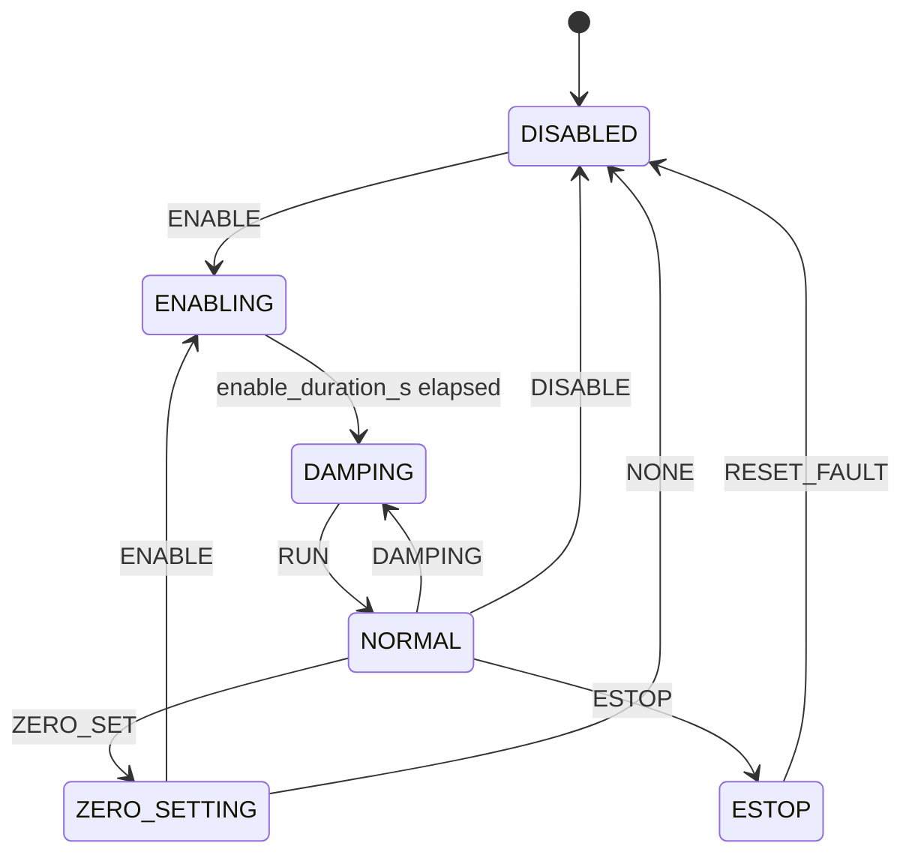

# Safety Notes

현재 runtime은 `ControllerStateMachine`과 `RobotController.tick()`의 상태별 output rule로 actuator output을 제한한다.

## Controller Modes

| Mode | Entry condition | Output |
| --- | --- | --- |
| `DISABLED` | startup, `DISABLE`, `RESET_FAULT` from `ESTOP` | disable all only |
| `ENABLING` | `ENABLE` from `DISABLED` or `ZERO_SETTING` | enable all only |
| `DAMPING` | `ENABLING` duration elapsed, or `DAMPING` operator command | damping-like MIT command only |
| `NORMAL` | `RUN` from `DAMPING` | policy command only |
| `ZERO_SETTING` | `ZERO_SET` operator command | zero set all only; `NONE` returns to `DISABLED` |
| `ESTOP` | `ESTOP` operator command | disable all only, latched |

`ESTOP` does not auto-clear.

## Hardware Startup Gate

Implemented in `robot_controller/config/validate_hardware_safety.py`.

| Condition | Behavior |
| --- | --- |
| simulation + real `canN` | startup reject |
| simulation + `can.motors.enter_on_start: true` | startup reject |
| hardware without `--hardware` | startup reject |
| hardware without `--i-understand-this-can-enable-motors` | startup reject |
| hardware + `vcan*` | startup reject |
| hardware + interface outside `hardware.allowed_can_interfaces` | startup reject |
| hardware + `hardware.allow_real_can: false` | startup reject |
| hardware + `hardware.require_manual_arm: false` | startup reject |
| hardware + `hardware.allow_enable_on_start: true` | startup reject |
| hardware + required E-stop without `--estop-ok` | startup reject |

## Current Fallbacks / Safety-Relevant Behavior

| Trigger | Current action | Notes |
| --- | --- | --- |
| operator `ESTOP` | `ESTOP` mode, repeated disable-all | clear requires `RESET_FAULT` |
| operator `DISABLE` | `DISABLED` mode, repeated disable-all | no policy read |
| operator `DAMPING` | `DAMPING` mode, repeated damping-like MIT command | no timeout is enforced in current `tick()` |
| controller shutdown | attempts one disable-all if CAN is connected | logs warning if send fails |
| unknown CAN ID in `ControlCommandShm` | skipped by `_send_policy_command()` | TODO(owner): decide whether this should fault in hardware mode |

## Config Values That Are Validated But Not Yet Enforced In Tick

| Key | Status |
| --- | --- |
| `safety.damping_timeout_s` | parsed/validated, not used by current state machine |
| `safety.command_loss_action` | parsed/validated, not used by current state machine |
| `safety.feedback_stale_action` | parsed/validated, not used by current state machine |

## Real Robot Checklist

- Confirm `runtime.mode: hardware`.
- Confirm CAN interface and bitrate externally with `ip link`.
- Confirm `hardware.allow_real_can: true`.
- Confirm `can.motors.enter_on_start: false`.
- Confirm dashboard/operator path writes `OperatorCommandShm`, not direct actuator enable commands in fault/estop states.
- Confirm actuator firmware behavior for the MIT damping-like command.
