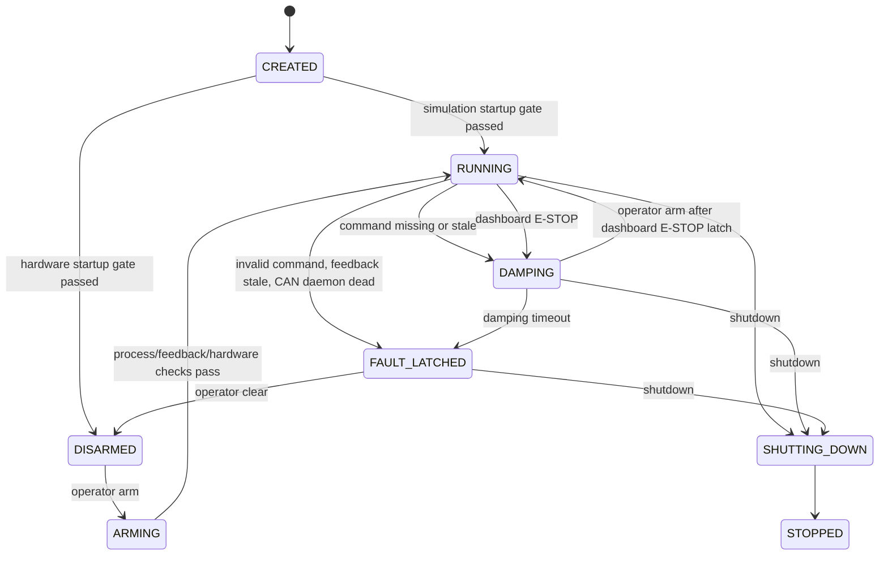

# Safety

근거 파일: `FALLBACK_POLICY.md`, `robot_controller/safety/*`, `robot_controller/control_loop.py`, `robot_controller/config/validate_hardware_safety.py`, `robot_controller/command/command_validator.py`, `robot_controller/hardware/motor_bus.py`.

## SafetyState

| State | 의미 | Policy command 송신 |
| --- | --- | --- |
| `CREATED` | `SafetyController` 생성 직후 | no |
| `DISARMED` | hardware mode 초기 상태 또는 fault clear 후 상태 | no |
| `ARMING` | operator arm 요청 후 조건 확인 중 | no |
| `READY` | 현재 구현에서 직접 사용하지 않음 | no |
| `RUNNING` | fresh valid command를 보낼 수 있는 상태 | yes |
| `DAMPING` | command loss/stale 또는 dashboard E-STOP으로 damping-like MIT command를 보낸 뒤 hold | no |
| `FAULT_LATCHED` | fault latch. operator clear 없이는 복구 불가 | no |
| `ESTOP` | reserved for physical E-stop integration; dashboard E-STOP currently enters `DAMPING` | no |
| `SHUTTING_DOWN` | controller shutdown 중 | no |
| `STOPPED` | shutdown 완료 | no |

## ControlAction

| Action | Motor output |
| --- | --- |
| `NO_OUTPUT` | CAN motor command 없음 |
| `SEND_POLICY_COMMAND` | validated policy MIT batch 전송 |
| `SEND_DAMPING` | q=0, qd=0, kp=0, kd=`safety.velocity_damping_kd`, tau=0 MIT command |
| `DISABLE_MOTORS` | MIT exit/disable frame 전송 |
| `SHUTDOWN` | 현재 main loop에서 직접 사용하지 않음 |

## Fault State Transition



## Safety Decision 입력

`SafetyController.evaluate()`는 다음을 입력으로 받는다.

| Input | Source |
| --- | --- |
| `RobotFeedback` | `RobotHardware.read_feedback()` |
| `CommandReadResult` | `ShmPolicyCommandSource.read_latest()` |
| `validated_command` / `command_validation_error` | `CommandValidator.validate()` |
| `ProcessHealth` | `ChildProcessManager.health()` |
| `HardwareStatus` | `RobotHardware.status()` |
| `OperatorCommand` | `OperatorCommandShmSource.read_latest()` from `qhrr_operator_command` |
| `now`, `now_unix` | control loop timestamp |

## 최소 판단 규칙

| Condition | Decision |
| --- | --- |
| CAN daemon client not connected | `FAULT_LATCHED` + `DISABLE_MOTORS` |
| `can_daemon_alive == false` | `FAULT_LATCHED` + `DISABLE_MOTORS` |
| operator `estop` from dashboard | `DAMPING` + `SEND_DAMPING` if MIT-enabled actuator feedback exists |
| operator `arm` while `DISARMED` | enter `ARMING`, then evaluate process/CAN/command state |
| operator `clear_fault` while `FAULT_LATCHED` | `DISARMED` + `NO_OUTPUT` |
| `task_controller_alive == false` | command loss path: `DAMPING` + `SEND_DAMPING` |
| hardware mode and `aux_reader_alive == false` | `FAULT_LATCHED` + `DISABLE_MOTORS` |
| command read unavailable/no command/collision | `safety.command_loss_action`, current config `damping` |
| command timestamp older than `can.command_timeout_s` | `DAMPING` + `SEND_DAMPING` |
| command validation error | `FAULT_LATCHED` + `DISABLE_MOTORS` |
| actuator feedback stale while command is fresh | `safety.feedback_stale_action`, current config `fault` |
| IMU feedback stale while command is fresh | `safety.feedback_stale_action`, current config `fault` |
| fresh valid command in `RUNNING` | `SEND_POLICY_COMMAND` |
| fresh valid command and fresh feedback in command-loss `DAMPING` | recover to `RUNNING` + `SEND_POLICY_COMMAND` before damping timeout |
| fresh valid command while dashboard E-STOP damping latch is active | remain `DAMPING` + `SEND_DAMPING` until operator `arm` |
| damping timeout while actuator `is_enabled == true` | `FAULT_LATCHED` + `SEND_DAMPING` |
| `FAULT_LATCHED` from damping timeout without operator clear | continue `SEND_DAMPING` while CAN daemon and MIT-enabled actuator feedback remain available |
| other `FAULT_LATCHED` without operator clear | `NO_OUTPUT` after initial fault action |
| physical `ESTOP` latched | UNKNOWN: not currently wired to dashboard E-STOP |

## Hardware/Simulation Gate

Startup validation은 `robot_controller.main`에서 `validate_runtime_safety()`로 수행된다.

| Mode | Reject condition |
| --- | --- |
| `simulation` | `can.interface`가 `can0`, `can1` 같은 real CAN |
| `simulation` | `can.motors.enter_on_start: true` |
| `hardware` | `--hardware` 없음 |
| `hardware` | `--i-understand-this-can-enable-motors` 없음 |
| `hardware` | `vcan*` interface |
| `hardware` | `can.interface`가 `hardware.allowed_can_interfaces`에 없음 |
| `hardware` | `hardware.allow_real_can != true` |
| `hardware` | `hardware.require_manual_arm != true` |
| `hardware` | `hardware.allow_enable_on_start != false` |
| `hardware` | `can.motors.enter_on_start: true` |
| `hardware` | `hardware.require_estop: true`이고 `--estop-ok` 없음 |

Hardware mode는 `SafetyState.DISARMED`에서 시작한다. Operator arm command는 dashboard가 `qhrr_operator_command` SHM에 쓰고 controller main loop가 one-shot으로 읽는다. CAN daemon은 actuator `MIT_ENTER` TX를 controller safety state 기준으로 gate한다. `DISARMED`, `FAULT_LATCHED`, `ESTOP`, `CREATED`, `SHUTTING_DOWN`, `STOPPED`, dashboard E-STOP damping latch, 또는 controller state unavailable이면 motor enable frame을 reject하고, `MIT_EXIT` disable frame은 허용한다.

## Fallback Table

| Trigger | State/Action | Motor output | Recovery |
| --- | --- | --- | --- |
| command missing and any actuator `is_enabled == true` | `DAMPING` + `SEND_DAMPING` | damping-like MIT command every control tick | fresh valid command + fresh feedback before damping timeout |
| command stale and any actuator `is_enabled == true` | `DAMPING` + `SEND_DAMPING` | damping-like MIT command every control tick | fresh valid command + fresh feedback before damping timeout |
| command missing/stale with no MIT-enabled actuator feedback | `DAMPING` + `NO_OUTPUT` | no motor output | MIT-enabled actuator feedback or fresh valid command |
| dashboard E-STOP and any actuator `is_enabled == true` | `DAMPING` + `SEND_DAMPING` | damping-like MIT command every control tick | operator `arm` |
| command invalid | `FAULT_LATCHED` + `DISABLE_MOTORS` | disable frames | operator clear path 필요 |
| actuator feedback stale | current config: `FAULT_LATCHED` + `DISABLE_MOTORS` | disable frames | operator clear path 필요 |
| IMU feedback stale | current config: `FAULT_LATCHED` + `DISABLE_MOTORS` | disable frames | operator clear path 필요 |
| CAN daemon dead | `FAULT_LATCHED` + `DISABLE_MOTORS` | disable 시도 | restart 필요 |
| task_controller dead and any actuator `is_enabled == true` | `DAMPING` + `SEND_DAMPING` | damping-like MIT command every control tick | task process alive + fresh valid command + fresh feedback |
| damping timeout with CAN daemon alive and actuator `is_enabled == true` | `FAULT_LATCHED` + `SEND_DAMPING` | damping-like MIT command every control tick | operator clear path 필요 |
| shutdown | `SHUTTING_DOWN` | damping-like MIT command 후 `exit_on_shutdown`이면 disable | process exit |

## Damping Command의 한계

`MotorBus.send_velocity_damping()`은 다음 command를 보낸다.

```text
q = 0
qd = 0
kp = 0
kd = safety.velocity_damping_kd
tau = 0
```

This fallback sends a MIT velocity damping-like command. It is not guaranteed to be hardware-safe until actuator firmware behavior is verified.

## 실제 로봇 실행 전 Checklist

| 확인 | 항목 |
| --- | --- |
| [ ] | **`runtime.mode: hardware`와 CLI flags를 함께 사용했는지 확인** |
| [ ] | **`hardware.allow_real_can: true`가 의도된 hardware config에서만 설정되었는지 확인** |
| [ ] | **`can.motors.enter_on_start: false`인지 확인** |
| [ ] | **E-stop 동작을 software와 독립적으로 확인한 뒤 `--estop-ok`를 사용** |
| [ ] | **dashboard `Arm` command와 실제 hardware arming 절차를 dry-run에서 검증** |
| [ ] | **damping-like MIT command의 firmware 동작 확인** |

## 검증 필요 항목

| 항목 | 질문 |
| --- | --- |
| Operator input | TODO(owner): arm/clear/E-stop command source 구현 |
| Firmware damping | TODO(owner): q=0, qd=0, kp=0, kd=0.5, tau=0 의미 검증 |
| Fault recovery | TODO(owner): `FAULT_LATCHED`에서 operator clear 후 재-arming 절차 |
