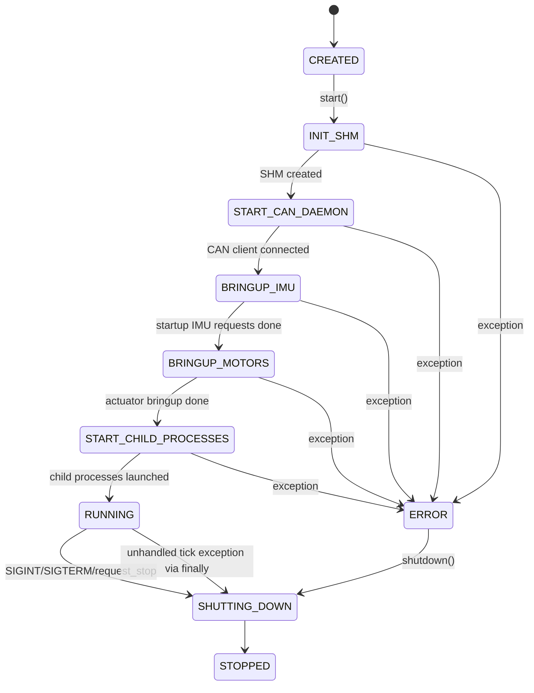

# Safety

근거 파일: `FALLBACK_POLICY.md`, `robot_controller/robot_controller.py`, `robot_controller/runtime_io.py`, `robot_controller/utils/process_supervisor.py`, `robot_controller/utils/shm_command_router.py`, `robot_controller/core/config.py`.

## Fallback Policy

`FALLBACK_POLICY.md`에서 확인된 project-wide policy:

1. Silent fallback is forbidden.
2. Any fallback must either transition to a safer state, or raise a fatal error.
3. Any fallback that changes runtime behavior must log a reason.
4. No fallback may infer motor ID, CAN ID, SHM layout, or command source.
5. In real mode, missing critical config is fatal.
6. Incomplete MIT command batch is invalid.
7. Previous command must never be held indefinitely.

## System State 정의

코드에 존재하는 state enum은 `RobotControllerState`이다. `idle`, `ready`, `damping`, `fault`, `emergency_stop`은 first-class enum으로 확인되지 않았다.

| 요청된 개념 | 현재 구현에서 확인된 대응 | 진입 조건 | 탈출 조건 |
| --- | --- | --- | --- |
| `idle` | `CREATED`, `STOPPED`에 가까움 | object 생성 또는 shutdown 완료 | `start()` 호출 |
| `ready` | 별도 state 없음 | UNKNOWN | UNKNOWN |
| `running` | `RUNNING` | SHM 생성, CAN daemon 연결, bringup, child process start 완료 | `request_stop()` 또는 exception |
| `damping` | enum 없음. `send_damping_once(reason)` action | missing/stale MIT batch, shutdown | fresh valid MIT batch가 들어오면 `mark_mit_command_active()` |
| `fault` | `ERROR` | `start()` 중 exception | `shutdown()` 후 process 종료 |
| `emergency_stop` | UNKNOWN | 코드에서 확인 안 됨 | UNKNOWN |

구현 state:

| `RobotControllerState` | 의미 |
| --- | --- |
| `CREATED` | controller object 생성 |
| `INIT_SHM` | stale SHM cleanup 및 SHM 생성 단계 |
| `START_CAN_DAEMON` | CAN daemon subprocess 시작 |
| `BRINGUP_IMU` | IMU startup request |
| `BRINGUP_MOTORS` | zero/enter motor mode |
| `START_CHILD_PROCESSES` | aux/task/dashboard 시작 |
| `RUNNING` | tick loop 실행 |
| `SHUTTING_DOWN` | shutdown action 수행 |
| `STOPPED` | shutdown 완료 |
| `ERROR` | start 중 exception 발생 |

## Fault State Transition

## Fallback Table

| Trigger condition | Action | Recovery condition | Log message | Test case |
| --- | --- | --- | --- | --- |
| `ShmMitCommandRouter.read_latest_batch()` returns `None` because no MIT command batch exists | `send_damping_once("no MIT command batch available")`: q=0, qd=0, kp=0, kd=0.5, tau=0 per configured CAN ID | Fresh valid batch arrives and `mark_mit_command_active()` clears previous reason | `Sending one damping command because no MIT command batch available` | Start controller without `task_controller` writer; inspect log and `candump` |
| MIT batch timestamp older than `can.command_timeout_s` | `send_damping_once("MIT command batch is stale: source=...")` | Fresh valid batch within timeout | `Sending one damping command because MIT command batch is stale: source=...` | Kill/pause `task_controller`; expect one damping command |
| Controller shutdown | `send_damping_once("controller shutdown")`, sleep 0.02, then MIT_EXIT per actuator if `exit_on_shutdown` | Process exits; restart requires normal startup | `Sending one damping command because controller shutdown` | Run controller, press Ctrl+C, inspect `candump` |
| MIT SHM odd/mismatched sequence collision longer than 0.002 s | Router returns `None`; controller path becomes missing batch damping | Next readable complete batch | No direct collision log; damping log if resulting batch is `None` | Fault inject writer collision; expect no previous command held indefinitely |
| Incomplete MIT target batch | `ValueError("Incomplete MIT command batch...")`; unhandled tick exception reaches `finally` shutdown | Fix writer target count and restart | Python traceback plus shutdown damping log | Publish fewer targets than configured |
| MIT target has duplicate/unknown CAN ID or non-finite/out-of-range field | `validate_mit_batch()` raises `ValueError`; main finally calls shutdown | Fix command producer/config and restart | Python traceback plus shutdown damping log | Publish NaN or unknown CAN ID target |
| `ProcessSupervisor.stop_by_name()` timeout | SIGKILL process/pgroup | Process exits or manual cleanup | `Killing process <name> after stop timeout ...` | Child process ignores SIGTERM |
| CAN daemon socket exists with `--replace-existing-socket` | Existing Unix socket unlinked before bind | New daemon binds socket | `Replacing existing CAN daemon IPC socket: ...` | Leave stale socket, start can_daemon with flag |
| `shutdown_actuators()` called before CAN client connected | Actuator shutdown CAN commands are skipped | UNKNOWN | `Skipping actuator shutdown because CAN daemon client was not connected` | Force startup failure before CAN connect |
| Dashboard CAN socket read error | Dashboard marks socket disconnected, closes socket, reconnect loop | Socket open succeeds later | `CAN socket close failed after RX error: ...` only if close fails | Bring interface down while dashboard runs |

## Command Timeout 정책

| Timeout | Value source | 동작 |
| --- | --- | --- |
| MIT command freshness | `app_config/robot_controller.yaml can.command_timeout_s: 0.05` | stale이면 damping once |
| Actuator feedback timeout | same `can.command_timeout_s` passed to `ActuatorDriver` | comm status에 stale/online 표시. 전역 fault 전환은 확인되지 않음 |
| IMU quat/gyro timeout | same `can.command_timeout_s` passed to `IMUDriver` | comm status에 stale/online 표시. 전역 fault 전환은 확인되지 않음 |
| Dashboard SHM stale | `app_config/dashboard.yaml robot_controller_state.stale_timeout_s: 0.5` | dashboard status가 `stale` |

## NaN/Inf Action 처리

| 경계 | 정책 |
| --- | --- |
| `task_controller` | policy output NaN/Inf 자체 검증은 확인되지 않음 |
| MIT command SHM reader | binary float를 읽음. non-finite 여부는 reader가 아니라 runtime validation에서 확인 |
| `RobotControllerRuntimeIO.validate_mit_batch()` | `math.isfinite()` 실패 시 `ValueError` |
| Robot State SHM JSON writer | `json.dumps(..., allow_nan=False)`로 NaN JSON publish는 RuntimeError/ValueError 가능 |

## CAN Timeout / Bus-off 처리

| 항목 | 확인된 구현 |
| --- | --- |
| CAN TX failure | `CANProcessClient.send()`가 `RuntimeError`를 raise |
| CAN daemon HAL send false | daemon이 `{"ok": false}` 반환, client가 RuntimeError |
| bus-off explicit recovery | UNKNOWN: bus-off 감지/복구 state machine 확인 안 됨 |
| RX own messages | CAN daemon raw socket에서 `CAN_RAW_RECV_OWN_MSGS=0`, runtime에도 0.25 s TX echo reject window 존재 |

## SHM Corruption / Version Mismatch 처리

| SHM | 확인된 처리 |
| --- | --- |
| Robot State magic/version mismatch | `RobotStateShmReader.read_latest()`가 `RuntimeError("Robot state SHM layout mismatch...")` |
| Robot State payload length invalid | `RuntimeError("Invalid robot state payload length...")` |
| Robot State JSON not mapping | `RuntimeError("Robot state SHM payload must decode to a mapping")` |
| MIT command magic/version mismatch | `ValueError("MIT command SHM layout mismatch...")` |
| MIT target count mismatch | `ValueError("Incomplete MIT command batch...")` |

## 실제 로봇 실행 전 Safety Checklist

| 확인 | 항목 |
| --- | --- |
| [ ] | **물리 E-stop 동작을 software 실행과 독립적으로 검증** |
| [ ] | **`enter_on_start`가 true일 때 actuator가 즉시 MIT mode로 들어가는 것을 허용할지 확인** |
| [ ] | **damping command가 q=0 기준이라는 점을 실제 자세에서 허용할지 확인** |
| [ ] | **`can.command_timeout_s`가 feedback 주기보다 과도하게 짧지 않은지 확인** |
| [ ] | **ONNX policy output과 `can.mit_limits` 불일치 시 fatal shutdown이 되는 것을 dry-run에서 확인** |
| [ ] | **CAN bus-off 발생 시 사람이 수행할 복구 절차 확보** |
| [ ] | **dashboard actuator command TX unlock/enable 조작 권한 확인** |

## 검증 필요 항목

| 항목 | 질문 |
| --- | --- |
| E-stop | TODO(owner): emergency stop input과 software state transition 설계 |
| CAN stale feedback | TODO(owner): actuator/IMU stale이 global fault로 이어져야 하는지 결정 |
| damping pose | TODO(owner): q=0 damping command가 실제 로봇에서 안전한 자세인지 검증 |
| shutdown before CAN connect | TODO(owner): CAN client 미연결 시 actuator shutdown skip을 허용할지 결정 |
