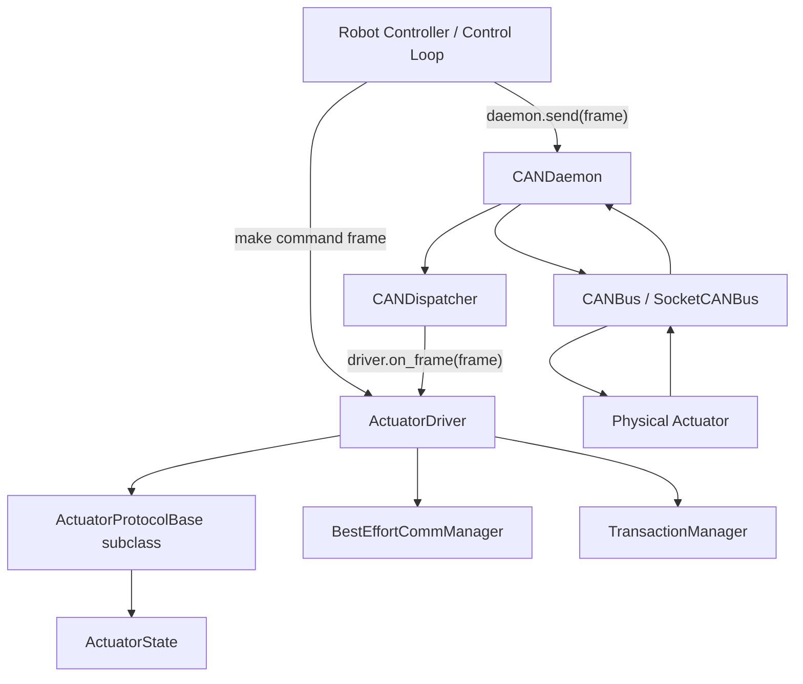

# CAN Actuator Module 설계 문서

## 1. 목적

이 문서는 CAN 기반 actuator 모듈의 `state.py`, `protocol.py`, `driver.py` 설계 의도와 사용법을 정리한 문서입니다.

이 모듈의 목표는 다음과 같습니다.

- 여러 제조사의 CAN actuator를 하나의 공통 구조로 다루기
- 제품별 CAN ID, payload layout, scaling, sign convention을 protocol 계층으로 격리하기
- actuator feedback을 로봇 내부 표준 단위로 정리하기
- `CANDaemon`과 actuator driver가 서로 직접 종속되지 않게 만들기
- 최신 feedback의 freshness와 communication fault를 공통 방식으로 관리하기
- 필요할 경우 request-response transaction tracking을 추가할 수 있게 만들기

---

## 2. 전체 구조

```text
hal.hardware.can.actuator
├── state.py
├── protocol.py
├── driver.py
└── protocols
    ├── dongilc.py
    ├── tmotor.py
    ├── rmd.py
    └── cia402.py
```

권장 관계는 다음과 같습니다.



핵심 원칙은 다음입니다.

```text
CANDaemon은 actuator를 모른다.
ActuatorDriver는 CANDaemon을 모른다.
Factory 또는 Manager가 daemon과 driver를 연결한다.
제품별 상세 CAN 프로토콜은 ActuatorProtocolBase 하위 클래스에 둔다.
```

---

## 3. 계층별 책임

| 계층 | 책임 | 알면 안 되는 것 |
|---|---|---|
| `CANDaemon` | CAN 송수신 실행, TX queue, RX dispatch | actuator 종류, CAN ID 의미, payload layout |
| `CANDispatcher` | CAN ID → callback 라우팅 | payload 의미, 장치 상태 |
| `ActuatorDriver` | state 보관, feedback merge, freshness 관리, 송신 frame 생성 위임 | SocketCAN, CANDaemon 내부 구조 |
| `ActuatorProtocolBase` | 제품별 CAN ID, opcode, payload encode/decode, scale 변환 | thread, daemon, dispatcher |
| `ActuatorState` | 제품 독립적인 actuator feedback 표현 | CAN raw byte 구조 |
| `BestEffortCommManager` | latest-value freshness, stale/fault 판단 | actuator payload 의미 |
| `TransactionManager` | optional request-response completion tracking | 실제 CAN 신뢰성 보장 |

---

## 4. `state.py`

### 4.1 역할

`state.py`는 actuator의 제품 독립적인 상태 표현을 정의합니다.

이 파일에는 다음 내용이 들어갑니다.

- actuator feedback state
- generic command container
- actuator limit container

반대로 아래 내용은 들어가면 안 됩니다.

- CAN ID
- opcode
- payload byte layout
- endian
- 제조사별 raw scale
- SocketCAN 관련 코드

---

### 4.2 `ActuatorState`

```python
@dataclass
class ActuatorState:
    position_rad: float | None = None
    velocity_rad_s: float | None = None
    torque_nm: float | None = None
    current_a: float | None = None

    temperature_c: float | None = None
    voltage_v: float | None = None

    fault_code: int | None = None
    is_enabled: bool | None = None
    mode: str | None = None

    last_feedback_t: float = 0.0

    raw: dict[str, Any] = field(default_factory=dict)
```

### 4.3 단위 convention

`ActuatorState`는 내부 단위를 통일합니다.

| 필드 | 단위 |
|---|---|
| `position_rad` | rad |
| `velocity_rad_s` | rad/s |
| `torque_nm` | Nm |
| `current_a` | A |
| `temperature_c` | degC |
| `voltage_v` | V |
| `last_feedback_t` | `time.monotonic()` 기준 초 |

제품별 raw unit은 protocol 계층에서 변환해야 합니다.

예를 들어 특정 모터가 position을 encoder count로 주더라도, `ActuatorState.position_rad`에는 반드시 rad 단위로 들어가야 합니다.

---

### 4.4 왜 대부분 Optional인가?

Actuator feedback frame은 제품마다 다릅니다.

예를 들어 어떤 제품은 한 frame에 다음 값만 보낼 수 있습니다.

```text
position, velocity, torque
```

다른 제품은 다음 값만 보낼 수 있습니다.

```text
voltage, temperature, fault_code
```

따라서 `ActuatorState`는 partial update를 허용해야 합니다.  
`ActuatorDriver`는 `None`이 아닌 값만 최신 state에 병합합니다.

---

### 4.5 `raw` 필드

```python
raw: dict[str, Any] = field(default_factory=dict)
```

`raw`는 아직 공통 state field로 승격하지 않은 제품별 debug 값을 보관하기 위한 공간입니다.

예:

```python
ActuatorState(
    position_rad=1.2,
    velocity_rad_s=0.4,
    raw={
        "encoder_raw": 123456,
        "status_word": 0x0047,
        "mos_temperature_c": 42.0,
    },
)
```

주의할 점은, 상위 제어 코드가 `raw`에 지나치게 의존하면 다시 제품별 코드가 밖으로 새어 나옵니다.  
중요한 값은 장기적으로 `ActuatorState`의 정식 필드로 올리는 것이 좋습니다.

---

### 4.6 `ActuatorCommand`

```python
@dataclass
class ActuatorCommand:
    position_rad: float | None = None
    velocity_rad_s: float | None = None
    torque_nm: float | None = None

    kp: float | None = None
    kd: float | None = None

    current_a: float | None = None
    mode: str | None = None
```

`ActuatorCommand`는 generic command container입니다.

다만 고주기 제어에서는 명시적인 메서드가 더 좋습니다.

```python
driver.make_torque_command_frame(torque_nm)
driver.make_impedance_command_frame(q, dq, kp, kd, tau_ff)
```

`ActuatorCommand`는 다음 상황에 유용합니다.

- GUI에서 들어온 명령
- config 기반 명령
- replay/log 기반 명령
- generic controller interface

---

### 4.7 `ActuatorLimits`

```python
@dataclass
class ActuatorLimits:
    position_min_rad: float | None = None
    position_max_rad: float | None = None
    velocity_max_rad_s: float | None = None
    torque_max_nm: float | None = None
    current_max_a: float | None = None
```

`ActuatorLimits`는 actuator limit 정보를 담기 위한 container입니다.

현재 generic `ActuatorDriver`는 이 limit을 직접 강제하지 않습니다.  
limit enforcement는 보통 다음 계층에서 처리하는 것이 좋습니다.

- safety layer
- controller layer
- command manager
- product-specific driver
- hardware protection layer

---

## 5. `protocol.py`

### 5.1 역할

`protocol.py`는 제품별 CAN actuator protocol이 따라야 하는 인터페이스를 정의합니다.

```python
class ActuatorProtocolBase(CANDeviceProtocolBase):
    ...
```

이 계층은 다음을 알고 있어야 합니다.

- command CAN ID
- feedback CAN ID
- opcode
- payload byte layout
- endian
- raw scale
- sign convention
- gear ratio 반영 방식
- enable/disable command format
- torque/velocity/position/impedance command format

반대로 다음은 몰라야 합니다.

- CANDaemon
- CANDispatcher
- RX/TX thread
- TX queue
- robot control loop

---

### 5.2 필수 메서드

#### `rx_can_ids()`

```python
@abstractmethod
def rx_can_ids(self) -> list[int]:
    raise NotImplementedError
```

이 actuator protocol이 수신해야 하는 CAN ID 목록을 반환합니다.

예:

```python
def rx_can_ids(self) -> list[int]:
    return [self.feedback_id]
```

이 값은 Dispatcher callback 등록에 사용됩니다.

```python
for can_id in driver.rx_can_ids():
    daemon.register_callback(can_id, driver.on_frame)
```

---

#### `decode_frame(frame)`

```python
@abstractmethod
def decode_frame(self, frame: CANFrame) -> ActuatorState | None:
    raise NotImplementedError
```

수신된 `CANFrame`을 해석해서 partial `ActuatorState`로 변환합니다.

예:

```python
def decode_frame(self, frame: CANFrame) -> ActuatorState | None:
    if frame.can_id != self.feedback_id:
        return None

    position_raw, velocity_raw, torque_raw, temp_raw = ...

    return ActuatorState(
        position_rad=position_raw * self.position_scale,
        velocity_rad_s=velocity_raw * self.velocity_scale,
        torque_nm=torque_raw * self.torque_scale,
        temperature_c=float(temp_raw),
        last_feedback_t=time.monotonic(),
    )
```

---

### 5.3 `is_feedback_frame()`

```python
def is_feedback_frame(self, frame: CANFrame) -> bool:
    return frame.can_id in self.rx_can_ids()
```

단순 helper입니다.

용도:

- frame 종류 확인
- decode error tracking
- transaction tracking
- debug logging

---

### 5.4 Optional command encoders

`ActuatorProtocolBase`는 여러 command encoder를 제공합니다.

```python
encode_enable_frame()
encode_disable_frame()
encode_damping_frame()
encode_clear_fault_frame()
encode_zero_position_frame()
encode_torque_command_frame(torque_nm)
encode_velocity_command_frame(velocity_rad_s)
encode_position_command_frame(position_rad, velocity_rad_s)
encode_impedance_command_frame(position_rad, velocity_rad_s, kp, kd, torque_ff_nm)
encode_command_frame(command)
```

기본 구현은 `NotImplementedError`를 발생시킵니다.

이 설계의 의도는 다음과 같습니다.

```text
지원하지 않는 command를 조용히 무시하거나 잘못된 frame으로 보내는 것보다,
명확하게 NotImplementedError를 발생시키는 것이 안전하다.
```

제품별 protocol은 지원하는 command만 override하면 됩니다.

예:

```python
class DongilCMotorProtocol(ActuatorProtocolBase):
    def encode_torque_command_frame(self, torque_nm: float) -> CANFrame:
        ...
```

---

## 6. `driver.py`

### 6.1 역할

`driver.py`의 `ActuatorDriver`는 제품 독립적인 actuator driver입니다.

이 클래스는 다음을 담당합니다.

- protocol 소유
- 최신 `ActuatorState` 보관
- Dispatcher callback인 `on_frame()` 제공
- `protocol.decode_frame()` 호출
- partial state merge
- feedback freshness 관리
- optional transaction tracking
- command frame 생성 helper 제공

이 클래스는 다음을 몰라야 합니다.

- CANDaemon
- SocketCAN
- CANBus
- 실제 send 호출
- 제품별 payload layout
- 제품별 raw scale

---

### 6.2 생성자

```python
def __init__(
    self,
    name: str,
    protocol: ActuatorProtocolBase,
    feedback_timeout: float = 0.05,
    comm_manager: BestEffortCommManager | None = None,
    transaction_manager: TransactionManager | None = None,
):
```

각 인자의 의미는 다음과 같습니다.

| 인자 | 의미 |
|---|---|
| `name` | actuator 이름. 예: `FL_hip`, `FR_knee` |
| `protocol` | 제품별 protocol 구현체 |
| `feedback_timeout` | feedback freshness timeout |
| `comm_manager` | latest-value freshness monitor |
| `transaction_manager` | request-response tracking manager |

기본적으로 `BestEffortCommManager`를 생성합니다.

```python
comm_manager or BestEffortCommManager(timeout=feedback_timeout)
```

이 manager는 마지막 수신 시각을 기준으로 actuator feedback이 stale인지 판단합니다.

---

### 6.3 `rx_can_ids()`

```python
def rx_can_ids(self) -> list[int]:
    return self.protocol.rx_can_ids()
```

driver는 CAN ID를 직접 소유하지 않습니다.  
CAN ID는 protocol이 압니다.

이 덕분에 driver는 제품 독립적으로 유지됩니다.

---

### 6.4 `on_frame(frame)`

```python
def on_frame(self, frame: CANFrame) -> None:
    try:
        partial_state = self.protocol.decode_frame(frame)
    except Exception:
        logger.exception(...)
        self.comm_manager.mark_decode_error()
        return

    if partial_state is None:
        return

    self._merge_state(partial_state)
    self.transaction_manager.mark_rx(frame.can_id)
```

`on_frame()`은 `CANDispatcher`가 호출하는 callback입니다.

수신 흐름은 다음과 같습니다.

```text
CANDaemon._rx_loop()
    -> CANBus.recv_frame()
    -> CANDispatcher.dispatch(frame)
    -> ActuatorDriver.on_frame(frame)
    -> ActuatorProtocolBase.decode_frame(frame)
    -> ActuatorDriver._merge_state(partial_state)
```

주의해야 할 점은 `on_frame()`이 보통 RX thread에서 호출된다는 것입니다.  
따라서 이 함수는 가볍게 유지해야 합니다.

해야 하는 것:

- payload decode
- state merge
- freshness update
- transaction mark

하지 않는 것이 좋은 것:

- 파일 저장
- plotting
- blocking wait
- sleep
- 긴 계산
- daemon.send() 재호출 루프

---

### 6.5 `_merge_state(partial_state)`

`_merge_state()`는 partial feedback을 최신 full state에 병합합니다.

```python
if partial_state.position_rad is not None:
    self._state.position_rad = partial_state.position_rad
```

즉, `None`이 아닌 필드만 갱신합니다.

이 방식은 여러 종류의 feedback packet을 지원하기 위해 필요합니다.

예:

```text
packet A:
    position, velocity

packet B:
    voltage, temperature, fault_code
```

두 packet 모두 같은 `ActuatorState`에 병합할 수 있습니다.

---

### 6.6 freshness update

```python
if partial_state.last_feedback_t > 0.0:
    self._state.last_feedback_t = partial_state.last_feedback_t
    self.comm_manager.mark_rx(partial_state.last_feedback_t)
else:
    self.comm_manager.mark_rx()
```

protocol이 feedback timestamp를 넣어주면 그 시간을 사용합니다.  
없으면 driver가 수신한 현재 시각을 기준으로 freshness를 갱신합니다.

상위 제어기는 다음처럼 확인할 수 있습니다.

```python
if not driver.is_fresh():
    # feedback timeout
    # safe mode, damping, estimator reject, fault handling
    ...
```

---

### 6.7 command frame 생성 helper

`ActuatorDriver`는 직접 CAN frame을 보내지 않고, frame만 생성합니다.

예:

```python
def make_torque_command_frame(self, torque_nm: float) -> CANFrame:
    return self.protocol.encode_torque_command_frame(torque_nm)
```

사용자는 이렇게 씁니다.

```python
frame = actuator.make_torque_command_frame(2.0)
daemon.send(frame)
```

이 구조의 장점:

```text
ActuatorDriver는 CANDaemon을 모른다.
CANDaemon은 ActuatorDriver를 모른다.
Manager 또는 factory가 둘을 연결한다.
```

---

### 6.8 transaction helper

```python
def start_transaction(self, expected_ids: set[int], timeout: float):
    return self.transaction_manager.start_transaction(...)
```

이 기능은 optional입니다.

용도:

- fault clear ACK 대기
- mode change response 대기
- parameter read response 대기
- calibration 완료 확인
- zero position command ACK 확인

현재 transaction tracking은 CAN ID 기반입니다.

```python
self.transaction_manager.mark_rx(frame.can_id)
```

주의할 점:

```text
같은 RX ID로 여러 종류의 응답이 섞이는 프로토콜에서는 CAN ID만으로 부족하다.
그 경우 payload-level predicate 또는 sequence id 기반 transaction manager가 필요하다.
```

예를 들어 나중에 다음 구조로 확장할 수 있습니다.

```python
expected = lambda frame: frame.can_id == 0x241 and frame.data[0] == CMD_READ_KP
```

---

## 7. 기본 사용법

### 7.1 제품별 protocol 구현

예를 들어 `DongilCMotorProtocol`을 만든다고 하면:

```python
class DongilCMotorProtocol(ActuatorProtocolBase):
    def __init__(self, command_id: int, feedback_id: int):
        self.command_id = command_id
        self.feedback_id = feedback_id

    def rx_can_ids(self) -> list[int]:
        return [self.feedback_id]

    def decode_frame(self, frame: CANFrame) -> ActuatorState | None:
        if frame.can_id != self.feedback_id:
            return None

        # 제품별 payload unpack
        # raw -> SI unit 변환

        return ActuatorState(
            position_rad=...,
            velocity_rad_s=...,
            torque_nm=...,
            last_feedback_t=time.monotonic(),
        )

    def encode_torque_command_frame(self, torque_nm: float) -> CANFrame:
        # torque_nm -> raw 변환
        return CANFrame(can_id=self.command_id, data=...)
```

---

### 7.2 driver 생성

```python
actuator = ActuatorDriver(
    name="FL_hip",
    protocol=DongilCMotorProtocol(
        command_id=0x141,
        feedback_id=0x241,
    ),
    feedback_timeout=0.05,
)
```

---

### 7.3 CANDaemon에 callback 등록

```python
for can_id in actuator.rx_can_ids():
    daemon.register_callback(can_id, actuator.on_frame)
```

이후 `CANDaemon`이 feedback frame을 수신하면 dispatcher가 자동으로 `actuator.on_frame(frame)`을 호출합니다.

---

### 7.4 명령 송신

```python
frame = actuator.make_torque_command_frame(1.5)
daemon.send(frame)
```

driver는 직접 송신하지 않습니다.  
송신은 `CANDaemon` 또는 상위 manager가 담당합니다.

---

### 7.5 상태 조회

```python
state = actuator.get_state()

print(state.position_rad)
print(state.velocity_rad_s)
print(state.torque_nm)
```

---

### 7.6 freshness 확인

```python
if actuator.is_fresh():
    state = actuator.get_state()
else:
    # feedback timeout
    # safe mode / damping / fault handling
    ...
```

또는 communication status를 직접 확인합니다.

```python
status = actuator.get_comm_status()

print(status.is_online)
print(status.is_stale)
print(status.rx_count)
print(status.timeout_count)
```

---

## 8. Factory 또는 Manager에서의 조립 예시

권장 조립 위치는 driver 내부가 아니라 factory/manager입니다.

```python
bus = SocketCANBus("can0")
daemon = CANDaemon(bus)

fl_hip = ActuatorDriver(
    name="FL_hip",
    protocol=DongilCMotorProtocol(command_id=0x141, feedback_id=0x241),
    feedback_timeout=0.05,
)

for can_id in fl_hip.rx_can_ids():
    daemon.register_callback(can_id, fl_hip.on_frame)

daemon.start()

daemon.send(fl_hip.make_enable_frame())
daemon.send(fl_hip.make_torque_command_frame(1.2))
```

이 구조에서 역할은 다음처럼 유지됩니다.

```text
Factory/Manager:
    객체 생성과 연결 담당

CANDaemon:
    송수신 실행 담당

ActuatorDriver:
    state와 callback 담당

ActuatorProtocol:
    제품별 CAN encode/decode 담당
```

---

## 9. 제품별 protocol 작성 위치

권장 구조:

```text
actuator
├── driver.py
├── protocol.py
├── state.py
└── protocols
    ├── __init__.py
    ├── dongilc.py
    ├── tmotor.py
    ├── rmd.py
    └── cia402.py
```

제품별 구현은 가능한 한 `protocols/*.py`에 둡니다.

예:

```python
class DongilCMotorProtocol(ActuatorProtocolBase):
    ...
```

대부분의 경우 제품별 `ActuatorDriver` 하위 클래스는 필요 없습니다.

---

## 10. 언제 제품별 Driver subclass가 필요한가?

아래 경우에는 제품별 driver subclass를 고려할 수 있습니다.

- enable sequence가 여러 단계인 경우
- calibration/homing state machine이 필요한 경우
- 여러 CAN frame을 조합해야 하나의 명령이 되는 경우
- feedback packet 여러 개를 복잡하게 fuse해야 하는 경우
- 제품별 safety state machine이 필요한 경우
- internal command scheduler가 필요한 경우

그 외에는 generic `ActuatorDriver + 제품별 Protocol` 조합이 더 깔끔합니다.

---

## 11. 주의할 점

### 11.1 고주기 제어에서 `deepcopy` 비용

`get_state()`는 내부 state 보호를 위해 `deepcopy`를 사용합니다.

```python
def get_state(self) -> ActuatorState:
    with self._lock:
        return deepcopy(self._state)
```

처음에는 안전하고 좋습니다.  
하지만 수백 Hz 이상에서 매우 자주 호출하면 비용이 생길 수 있습니다.

나중에 성능이 문제되면 다음 중 하나로 바꿀 수 있습니다.

- shallow copy
- immutable snapshot
- numpy/torch tensor state buffer
- lock-free double buffer

---

### 11.2 transaction manager는 현재 CAN ID 기반

현재 transaction tracking은 expected CAN ID set으로만 완료 여부를 판단합니다.

```python
expected_ids={0x241}
```

같은 RX ID 안에서 여러 종류의 response가 섞이면 이 방식은 부족합니다.

그 경우에는 다음이 필요합니다.

- payload predicate
- command echo matching
- sequence number
- register address matching
- transaction id

---

### 11.3 feedback timeout은 제어 주기보다 여유 있게

예를 들어 actuator feedback이 500 Hz라면 nominal period는 2 ms입니다.  
이때 timeout을 2 ms로 잡으면 scheduling jitter 때문에 fault가 자주 뜰 수 있습니다.

보통은 다음처럼 여러 cycle을 허용합니다.

```text
feedback period = 2 ms
timeout = 10 ms ~ 20 ms
```

실험적으로 bus load, Linux scheduling jitter, device response delay를 고려해서 조정해야 합니다.

---

## 12. 향후 확장 제안

### 12.1 Capability 추가

제품마다 지원 기능이 다르므로 protocol에 capability를 추가하면 좋습니다.

```python
@dataclass
class ActuatorCapability:
    supports_enable: bool = False
    supports_damping: bool = False
    supports_torque_control: bool = False
    supports_velocity_control: bool = False
    supports_position_control: bool = False
    supports_impedance_control: bool = False
    supports_zero_position: bool = False
```

사용 예:

```python
if actuator.protocol.capability.supports_torque_control:
    daemon.send(actuator.make_torque_command_frame(tau))
```

---

### 12.2 Safety wrapper 추가

Actuator command는 실수하면 위험하므로, 나중에는 command 생성 전에 safety wrapper를 두는 것이 좋습니다.

예:

```python
safe_frame = safety_layer.make_safe_torque_command(actuator, torque_nm)
daemon.send(safe_frame)
```

safety layer에서는 다음을 검사할 수 있습니다.

- torque limit
- velocity limit
- position soft limit
- stale feedback
- thermal fault
- bus fault
- command age

---

### 12.3 Periodic command manager

고주기 motor command는 매번 application에서 직접 send하기보다 periodic command manager를 둘 수 있습니다.

```text
Control loop
    -> latest desired command update

PeriodicCommandManager
    -> fixed-rate frame generation
    -> daemon.send(frame)
```

다만 Python에서 hard real-time 1 kHz를 기대하면 안 됩니다.  
실제 안전-critical 제어는 C++ realtime thread, MCU, 또는 motor-side watchdog과 함께 설계하는 것이 좋습니다.

---

## 13. 요약

세 파일의 의도는 다음과 같습니다.

```text
state.py
    actuator의 제품 독립적인 물리 상태와 명령 표현

protocol.py
    제품별 CAN protocol이 구현해야 할 interface

driver.py
    제품 독립적인 actuator driver
    protocol을 사용해 수신 frame을 state로 병합하고,
    freshness와 optional transaction 상태를 관리
```

가장 중요한 설계 원칙은 다음입니다.

```text
제품별 차이는 protocol에 둔다.
driver는 generic하게 유지한다.
CANDaemon과 driver는 서로 직접 알지 않는다.
Factory/Manager가 daemon과 driver를 연결한다.
```

이 구조를 유지하면 actuator 제조사가 추가되어도 상위 제어 코드는 크게 바뀌지 않습니다.
