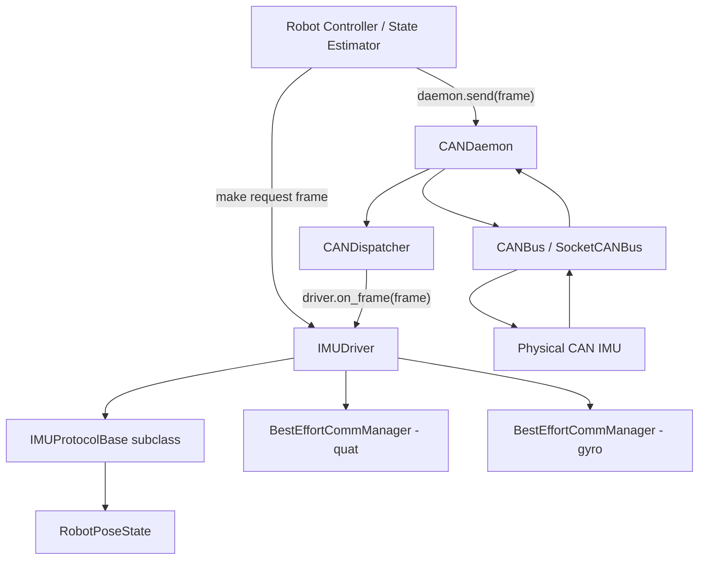

# CAN IMU Module 설계 문서

## 1. 목적

이 문서는 CAN 기반 IMU 모듈의 `state.py`, `protocol.py`, `driver.py` 설계 의도와 사용법을 정리한 문서입니다.

이 모듈의 목표는 다음과 같습니다.

- 여러 CAN IMU 제품을 하나의 공통 driver 구조로 다루기
- 제품별 CAN ID, request command, payload layout, scale, 좌표계 convention을 protocol 계층으로 격리하기
- IMU 상태를 로봇 내부 표준 단위로 정리하기
- `CANDaemon`과 `IMUDriver`가 서로 직접 종속되지 않게 만들기
- quaternion feedback과 gyro feedback의 freshness를 분리해서 관리하기
- request-response pairing 없이도 latest-value cache 방식으로 IMU 상태를 안정적으로 사용할 수 있게 만들기

---

## 2. 권장 파일 구조

```text
hal.hardware.can.imu
├── state.py
├── protocol.py
├── driver.py
└── protocols
    ├── e2box.py
    ├── vendor_a.py
    └── vendor_b.py
```

각 파일의 역할은 다음과 같습니다.

| 파일 | 역할 |
|---|---|
| `state.py` | 제품 독립적인 IMU 상태 컨테이너 |
| `protocol.py` | 제품별 IMU protocol이 구현해야 할 base interface |
| `driver.py` | 제품 독립적인 generic IMU driver |
| `protocols/*.py` | 제품별 CAN ID, payload decode, request encode 구현 |

---

## 3. 전체 구조



핵심 원칙은 다음입니다.

```text
CANDaemon은 IMU를 모른다.
IMUDriver는 CANDaemon을 모른다.
Factory 또는 Manager가 daemon과 driver를 연결한다.
제품별 상세 CAN 프로토콜은 IMUProtocolBase 하위 클래스에 둔다.
```

---

## 4. 계층별 책임

| 계층 | 책임 | 알면 안 되는 것 |
|---|---|---|
| `CANDaemon` | CAN 송수신 실행, TX queue, RX dispatch | IMU 종류, CAN ID 의미, payload layout |
| `CANDispatcher` | CAN ID → callback 라우팅 | payload 의미, IMU 상태 |
| `IMUDriver` | state 보관, partial state merge, freshness 관리, request frame 생성 위임 | SocketCAN, CANDaemon 내부 구조 |
| `IMUProtocolBase` | 제품별 CAN ID, request command, payload encode/decode, 좌표계 convention | thread, daemon, dispatcher |
| `RobotPoseState` | 제품 독립적인 IMU 상태 표현 | CAN raw byte 구조 |
| `BestEffortCommManager` | latest-value freshness, stale/fault 판단 | IMU payload 의미 |

---

## 5. `state.py`

### 5.1 역할

`state.py`는 IMU의 제품 독립적인 상태 표현을 정의합니다.

이 파일에는 다음 내용이 들어갑니다.

- decoded quaternion
- decoded angular velocity
- projected gravity
- feedback update timestamp

반대로 아래 내용은 들어가면 안 됩니다.

- CAN ID
- request opcode
- payload byte layout
- endian
- 제조사별 scale factor
- 제품별 좌표계 보정 로직

---

### 5.2 `RobotPoseState`

```python
@dataclass
class RobotPoseState:
    quat_xyzw: tuple[float, float, float, float] | None = None
    angular_velocity_rad_s: tuple[float, float, float] | None = None
    projected_gravity_b: tuple[float, float, float] | None = None

    last_quat_t: float = 0.0
    last_gyro_t: float = 0.0
```

### 5.3 단위 convention

| 필드 | 의미 | 단위 / 표현 |
|---|---|---|
| `quat_xyzw` | body orientation quaternion | `(qx, qy, qz, qw)` |
| `angular_velocity_rad_s` | body angular velocity | `rad/s` |
| `projected_gravity_b` | body frame projected gravity | unit vector |
| `last_quat_t` | quaternion update time | `time.monotonic()` seconds |
| `last_gyro_t` | gyro update time | `time.monotonic()` seconds |

제품별 raw unit, axis order, quaternion order는 protocol 계층에서 변환해야 합니다.

예를 들어 어떤 IMU가 quaternion을 `qz, qy, qx, qw` 순서로 보내더라도, `RobotPoseState.quat_xyzw`에는 반드시 `(qx, qy, qz, qw)` 순서로 들어가야 합니다.

---

### 5.4 왜 partial update를 허용하는가?

IMU는 quaternion과 gyro를 서로 다른 CAN frame으로 보낼 수 있습니다.

예:

```text
0x2A1 -> quaternion feedback
0x321 -> gyro feedback
```

따라서 어떤 수신 frame은 quaternion만 갱신하고, 어떤 수신 frame은 angular velocity만 갱신합니다.

이 때문에 `RobotPoseState`의 주요 field는 `None`을 허용합니다.

---

### 5.5 `IMUState` alias

```python
IMUState = RobotPoseState
```

기존 코드가 `IMUState`를 import하고 있다면 호환을 유지하기 위한 alias입니다.

장기적으로는 둘 중 하나로 정리하는 것이 좋습니다.

```text
1. RobotPoseState 하나만 사용
2. IMUState를 상위 상태 컨테이너로 확장하고 그 안에 RobotPoseState를 포함
```

현재 구조에서는 `RobotPoseState` 하나로 통일하는 방향이 가장 단순합니다.

---

## 6. `protocol.py`

### 6.1 역할

`protocol.py`는 제품별 CAN IMU protocol이 따라야 하는 base interface를 정의합니다.

```python
class IMUProtocolBase(ABC):
    ...
```

이 계층은 다음을 알고 있어야 합니다.

- request CAN ID
- response CAN ID
- request command byte
- payload byte layout
- endian
- scale factor
- quaternion order
- gyro unit
- 제품별 좌표계 convention

반대로 다음은 몰라야 합니다.

- CANDaemon
- CANDispatcher
- RX/TX thread
- TX queue
- robot control loop
- state storage policy

---

### 6.2 필수 메서드

#### `rx_can_ids()`

```python
def rx_can_ids(self) -> list[int]:
    ...
```

이 IMU protocol이 수신해야 하는 CAN ID 목록을 반환합니다.

이 값은 Dispatcher callback 등록에 사용됩니다.

```python
for can_id in imu.rx_can_ids():
    daemon.register_callback(can_id, imu.on_frame)
```

---

#### `encode_request_quat()`

```python
def encode_request_quat(self) -> CANFrame:
    ...
```

quaternion feedback을 요청하는 CAN frame을 생성합니다.

이 메서드는 frame을 실제로 송신하지 않습니다.  
실제 송신은 외부 manager 또는 controller가 `daemon.send(frame)`으로 수행합니다.

---

#### `encode_request_gyro()`

```python
def encode_request_gyro(self) -> CANFrame:
    ...
```

gyro feedback을 요청하는 CAN frame을 생성합니다.

---

#### `encode_request_all()`

```python
def encode_request_all(self) -> CANFrame:
    ...
```

지원되는 주요 IMU feedback을 한 번에 요청하는 CAN frame을 생성합니다.

이 요청 하나에 대해 응답 frame이 여러 개 올 수 있습니다.

예:

```text
TX: request_all
RX: quaternion frame
RX: gyro frame
```

이 경우 strict TX-RX pairing보다는 `IMUDriver`의 latest-value cache와 freshness timeout으로 관리하는 것이 일반적으로 단순합니다.

---

#### `decode_frame(frame)`

```python
def decode_frame(self, frame: CANFrame) -> RobotPoseState | None:
    ...
```

수신된 `CANFrame`을 해석해서 partial `RobotPoseState`로 변환합니다.

반환값 의미:

| 반환값 | 의미 |
|---|---|
| `RobotPoseState` | 이 protocol이 처리할 수 있는 frame이며, partial state를 반환 |
| `None` | 이 protocol이 처리하지 않는 frame |

중요한 설계 원칙:

```text
Protocol은 state를 저장하지 않는다.
Protocol은 frame을 해석해서 partial state만 반환한다.
State merge는 IMUDriver가 담당한다.
```

---

### 6.3 Optional helper

#### `is_quat_frame(frame)`

```python
def is_quat_frame(self, frame: CANFrame) -> bool:
    return False
```

제품별 protocol에서 override하면 decode error를 quaternion feedback 쪽에 정확히 기록할 수 있습니다.

#### `is_gyro_frame(frame)`

```python
def is_gyro_frame(self, frame: CANFrame) -> bool:
    return False
```

제품별 protocol에서 override하면 decode error를 gyro feedback 쪽에 정확히 기록할 수 있습니다.

---

## 7. `driver.py`

### 7.1 역할

`driver.py`의 `IMUDriver`는 제품 독립적인 generic CAN IMU driver입니다.

이 클래스는 다음을 담당합니다.

- protocol 소유
- 최신 `RobotPoseState` 보관
- Dispatcher callback인 `on_frame()` 제공
- `protocol.decode_frame()` 호출
- partial state merge
- quaternion freshness 관리
- gyro freshness 관리
- request frame 생성 helper 제공

이 클래스는 다음을 몰라야 합니다.

- CANDaemon
- SocketCAN
- CANBus
- 실제 send 호출
- 제품별 payload layout
- 제품별 scale factor
- 제품별 axis convention

---

### 7.2 생성자

```python
def __init__(
    self,
    name: str,
    protocol: IMUProtocolBase,
    quat_timeout: float,
    gyro_timeout: float,
):
```

각 인자의 의미는 다음과 같습니다.

| 인자 | 의미 |
|---|---|
| `name` | IMU 이름. 예: `body_imu`, `base_imu` |
| `protocol` | 제품별 IMU protocol 구현체 |
| `quat_timeout` | quaternion feedback freshness timeout |
| `gyro_timeout` | gyro feedback freshness timeout |

quaternion과 gyro는 서로 다른 frame으로 들어올 수 있으므로 freshness manager도 분리합니다.

```python
self.quat_comm = BestEffortCommManager(timeout=quat_timeout)
self.gyro_comm = BestEffortCommManager(timeout=gyro_timeout)
```

---

### 7.3 `rx_can_ids()`

```python
def rx_can_ids(self) -> list[int]:
    return self.protocol.rx_can_ids()
```

driver는 CAN ID를 직접 소유하지 않습니다.  
CAN ID는 protocol이 압니다.

이 설계 덕분에 `IMUDriver`는 제품 독립적으로 유지됩니다.

---

### 7.4 request frame 생성 helper

```python
def make_request_quat_frame(self) -> CANFrame:
    return self.protocol.encode_request_quat()

def make_request_gyro_frame(self) -> CANFrame:
    return self.protocol.encode_request_gyro()

def make_request_all_frame(self) -> CANFrame:
    return self.protocol.encode_request_all()
```

driver는 직접 송신하지 않고, frame만 생성합니다.

사용 예:

```python
daemon.send(imu.make_request_all_frame())
```

이 구조의 장점은 다음입니다.

```text
IMUDriver는 CANDaemon을 모른다.
CANDaemon은 IMUDriver를 모른다.
Factory 또는 Manager가 둘을 연결한다.
```

---

### 7.5 `on_frame(frame)`

```python
def on_frame(self, frame: CANFrame) -> None:
    try:
        partial_state = self.protocol.decode_frame(frame)
    except Exception:
        ...
        self._mark_decode_error(frame)
        return

    if partial_state is None:
        return

    self._merge_state(partial_state)
```

`on_frame()`은 `CANDispatcher`가 호출하는 callback입니다.

수신 흐름은 다음과 같습니다.

```text
CANDaemon._rx_loop()
    -> CANBus.recv_frame()
    -> CANDispatcher.dispatch(frame)
    -> IMUDriver.on_frame(frame)
    -> IMUProtocolBase.decode_frame(frame)
    -> IMUDriver._merge_state(partial_state)
```

`on_frame()`은 보통 RX thread에서 호출됩니다.  
따라서 이 함수는 가볍게 유지해야 합니다.

해야 하는 것:

- payload decode
- state merge
- freshness update
- decode error count update

하지 않는 것이 좋은 것:

- 파일 저장
- plotting
- blocking wait
- sleep
- 긴 계산
- daemon.send() 재호출 루프

---

### 7.6 `_merge_state(partial_state)`

```python
def _merge_state(self, partial_state: RobotPoseState) -> None:
    ...
```

이 함수는 partial state를 최신 full state에 병합합니다.

quaternion frame 수신 시:

```python
self._state.quat_xyzw = partial_state.quat_xyzw
self._state.projected_gravity_b = partial_state.projected_gravity_b
self._state.last_quat_t = partial_state.last_quat_t
self.quat_comm.mark_rx(partial_state.last_quat_t)
```

gyro frame 수신 시:

```python
self._state.angular_velocity_rad_s = partial_state.angular_velocity_rad_s
self._state.last_gyro_t = partial_state.last_gyro_t
self.gyro_comm.mark_rx(partial_state.last_gyro_t)
```

즉, quaternion과 gyro를 독립적으로 갱신하고 freshness도 독립적으로 관리합니다.

---

### 7.7 `_mark_decode_error(frame)`

```python
def _mark_decode_error(self, frame: CANFrame) -> None:
    ...
```

decode 실패 시 어떤 feedback stream에서 문제가 생겼는지 기록합니다.

제품별 protocol이 `is_quat_frame()` 또는 `is_gyro_frame()`을 override했다면 해당 stream에만 decode error를 기록합니다.

override하지 않았다면 fallback으로 두 manager 모두에 error를 기록할 수 있습니다.

---

### 7.8 freshness 확인

```python
def is_fresh(self) -> bool:
    quat_status = self.quat_comm.update_fault_flags()
    gyro_status = self.gyro_comm.update_fault_flags()

    return (not quat_status.is_stale) and (not gyro_status.is_stale)
```

기본 정책은 quaternion과 gyro가 모두 fresh해야 `True`입니다.

상황에 따라 상위 제어기는 더 세밀한 정책을 사용할 수 있습니다.

예:

```python
status = imu.get_comm_status()

quat_ok = not status["quat"].is_stale
gyro_ok = not status["gyro"].is_stale
```

---

### 7.9 상태 조회

```python
def get_state(self) -> RobotPoseState:
    with self._lock:
        return deepcopy(self._state)
```

내부 state를 직접 반환하지 않고 복사본을 반환합니다.  
이렇게 하면 외부 코드가 반환된 state를 수정해도 driver 내부 state가 오염되지 않습니다.

---

## 8. 기본 사용법

### 8.1 제품별 protocol 구현

예를 들어 E2Box IMU protocol은 다음처럼 구현할 수 있습니다.

```python
class E2BoxIMUProtocol(IMUProtocolBase):
    def rx_can_ids(self) -> list[int]:
        return [self.QUAT_ID, self.GYRO_ID]

    def encode_request_all(self) -> CANFrame:
        return CANFrame(can_id=self.REQ_ID, data=bytes([self.CMD_GET_ALL]))

    def decode_frame(self, frame: CANFrame) -> RobotPoseState | None:
        if frame.can_id == self.QUAT_ID:
            return self._decode_quat(frame.data)

        if frame.can_id == self.GYRO_ID:
            return self._decode_gyro(frame.data)

        return None
```

제품별 구현은 `protocols/e2box.py` 같은 파일에 두는 것을 권장합니다.

---

### 8.2 driver 생성

```python
imu = IMUDriver(
    name="body_imu",
    protocol=E2BoxIMUProtocol(),
    quat_timeout=0.05,
    gyro_timeout=0.05,
)
```

---

### 8.3 CANDaemon에 callback 등록

```python
for can_id in imu.rx_can_ids():
    daemon.register_callback(can_id, imu.on_frame)
```

이후 `CANDaemon`이 해당 CAN ID를 수신하면 dispatcher가 `imu.on_frame(frame)`을 호출합니다.

---

### 8.4 request 송신

```python
daemon.send(imu.make_request_all_frame())
```

driver는 직접 송신하지 않습니다.  
송신은 `CANDaemon` 또는 상위 manager가 담당합니다.

---

### 8.5 state 사용

```python
if imu.is_fresh():
    state = imu.get_state()

    quat = state.quat_xyzw
    omega = state.angular_velocity_rad_s
    gravity = state.projected_gravity_b
else:
    # Reject IMU update or enter safe mode.
    ...
```

---

## 9. Factory 또는 Manager에서의 조립 예시

권장 조립 위치는 driver 내부가 아니라 factory/manager입니다.

```python
bus = SocketCANBus("can0")
daemon = CANDaemon(bus)

imu = IMUDriver(
    name="body_imu",
    protocol=E2BoxIMUProtocol(),
    quat_timeout=0.05,
    gyro_timeout=0.05,
)

for can_id in imu.rx_can_ids():
    daemon.register_callback(can_id, imu.on_frame)

daemon.start()

daemon.send(imu.make_request_all_frame())
```

역할은 다음처럼 유지됩니다.

```text
Factory/Manager:
    객체 생성과 연결 담당

CANDaemon:
    송수신 실행 담당

IMUDriver:
    state와 callback 담당

IMUProtocol:
    제품별 CAN encode/decode 담당
```

---

## 10. 제품별 protocol 작성 위치

권장 구조:

```text
imu
├── driver.py
├── protocol.py
├── state.py
└── protocols
    ├── __init__.py
    ├── e2box.py
    ├── vendor_a.py
    └── vendor_b.py
```

제품별 구현은 가능한 한 `protocols/*.py`에 둡니다.

대부분의 경우 제품별 `IMUDriver` 하위 클래스는 필요 없습니다.

---

## 11. 언제 제품별 Driver subclass가 필요한가?

아래 경우에는 제품별 driver subclass를 고려할 수 있습니다.

- IMU 초기화 sequence가 복잡한 경우
- calibration state machine이 필요한 경우
- 여러 frame을 조합해야 하나의 상태가 되는 경우
- 제품별 fault handling이 복잡한 경우
- request scheduling 정책이 제품별로 다른 경우
- streaming mode 설정과 상태 관리가 driver 정책까지 침범하는 경우

그 외에는 generic `IMUDriver + 제품별 Protocol` 조합이 더 깔끔합니다.

---

## 12. 주의할 점

### 12.1 `deepcopy` 비용

`get_state()`는 내부 state 보호를 위해 `deepcopy`를 사용합니다.

초기에는 안전하고 좋습니다.  
하지만 고주기 제어 루프에서 매우 자주 호출하면 비용이 생길 수 있습니다.

성능 문제가 생기면 다음 방식을 고려할 수 있습니다.

- shallow copy
- immutable snapshot
- double buffer
- lock-free read-only state snapshot

---

### 12.2 timeout은 수신 주기보다 여유 있게

예를 들어 IMU request/response 주기가 100 Hz라면 nominal period는 10 ms입니다.  
이때 timeout을 10 ms로 잡으면 scheduling jitter나 arbitration delay 때문에 fault가 자주 발생할 수 있습니다.

보통은 여러 cycle을 허용합니다.

```text
feedback period = 10 ms
timeout = 30 ms ~ 50 ms
```

실험적으로 bus load, Linux scheduling jitter, device response delay를 고려해 조정해야 합니다.

---

### 12.3 strict TX-RX pairing은 기본 정책이 아님

이 driver는 request와 response를 엄격하게 pairing하지 않습니다.

기본 정책은 다음입니다.

```text
latest received quaternion을 유지한다.
latest received gyro를 유지한다.
정해진 시간 동안 업데이트가 없으면 stale로 본다.
```

설정 변경, calibration, ACK 확인이 필요한 명령은 별도의 transaction manager 또는 제품별 manager에서 처리하는 것이 좋습니다.

---

## 13. 향후 확장 제안

### 13.1 Streaming mode 지원

일부 IMU는 request-response가 아니라 주기적으로 feedback을 broadcast합니다.

이 경우 `make_request_*_frame()`을 거의 사용하지 않고, `on_frame()`과 freshness monitor만으로 동작할 수 있습니다.

---

### 13.2 Mounting transform 분리

제품별 protocol이 raw frame convention을 robot body convention으로 바꾸는 경우가 있습니다.

장착 방향에 따른 보정이라면 protocol보다 별도 transform 계층으로 분리하는 것이 더 적절할 수 있습니다.

권장 분리:

```text
Protocol:
    raw CAN payload -> vendor-frame physical quantity

MountingTransform:
    vendor/body mounting frame -> robot body frame

Driver:
    final RobotPoseState merge
```

---

### 13.3 Fine-grained freshness policy

기본 `is_fresh()`는 quaternion과 gyro 둘 다 fresh해야 `True`입니다.

상위 estimator에 따라 다음처럼 세밀하게 사용할 수 있습니다.

```text
orientation estimator:
    quaternion freshness 필요

angular-rate controller:
    gyro freshness 필요

RL observation:
    projected gravity + gyro freshness 필요
```

---

## 14. 요약

세 파일의 의도는 다음과 같습니다.

```text
state.py
    IMU의 제품 독립적인 로봇 내부 상태 표현

protocol.py
    제품별 CAN IMU protocol이 구현해야 할 interface

driver.py
    제품 독립적인 IMU driver
    protocol을 사용해 수신 frame을 state로 병합하고,
    quaternion/gyro freshness를 관리
```

가장 중요한 설계 원칙은 다음입니다.

```text
제품별 차이는 protocol에 둔다.
driver는 generic하게 유지한다.
CANDaemon과 driver는 서로 직접 알지 않는다.
Factory/Manager가 daemon과 driver를 연결한다.
```

이 구조를 유지하면 IMU 제품이 바뀌어도 상위 제어 코드와 CAN daemon 구조를 거의 유지할 수 있습니다.
